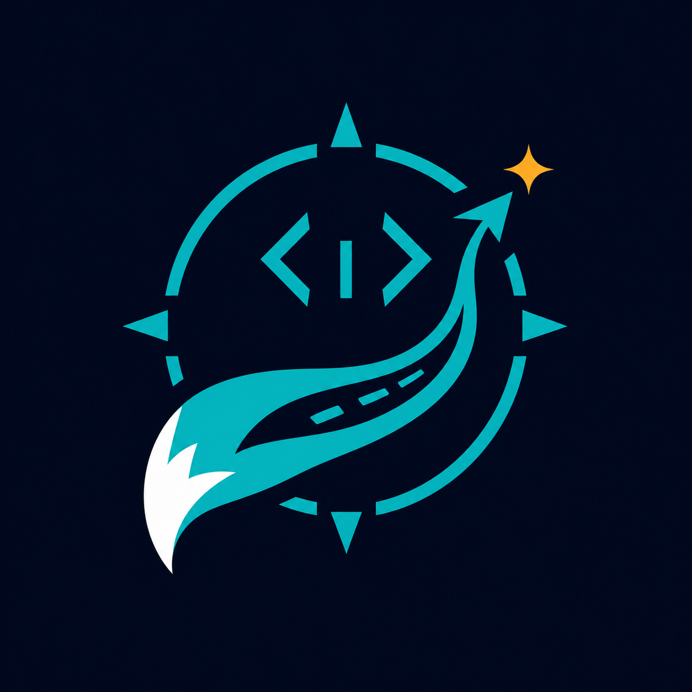
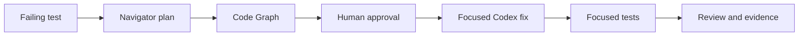
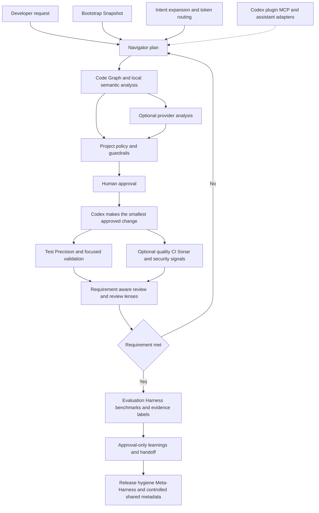

<p align="center">
  
</p>

<h1 align="center">TailTrail</h1>

<p align="center">Created by <strong>Vishrut Singhal</strong></p>

<p align="center">
  <strong>Keep AI-assisted code changes focused, reviewable, and provable.</strong><br />
  OpenAI Build Week 2026 Developer Tools submission
</p>

<p align="center">
  <code>Navigator-first</code> | <code>Local-first</code> | <code>Approval-first</code> | <code>Harness validation</code>
</p>

---

### What TailTrail is

TailTrail is a small local development helper for making cleaner, smaller, reuse-first code changes.

TailTrail's default workflow is simple: start with one command, review the plan, then approve or edit the next step. The goal is to help an agent read the existing code before changing it, reuse project patterns, avoid unnecessary dependencies, keep diffs easy to review, and preserve important safeguards.

```text
+--------------------------------------------+
| TailTrail                                  |
| Navigator online. Context stays lean.      |
|                                            |
| Navigator * Code Graph * Guardrails        |
| AIDLC * Review Lenses * Test Precision     |
| Token Budget * CI/Sonar * Security         |
| Learning * Handoff * Value Reports         |
| Meta-Harness * Shared Metadata             |
+--------------------------------------------+
```


## The problem

Small coding tasks should stay small. But AI-assisted changes can drift into
unnecessary rewrites, lose the actual requirement, and leave weak validation
evidence.

TailTrail adds a lightweight workflow around Codex: make a plan, map the right
code, get approval, make the smallest fix, run focused validation, and keep
clear evidence.



## End-to-end workflow

The Build Week demo uses the central path. The other feature families are
available when a task needs them. TailTrail does not silently run tools, edit
code, install dependencies, or share data.



| Stage | TailTrail feature families | Human control |
| --- | --- | --- |
| Understand | Navigator, intent expansion, Bootstrap Snapshot, token routing | Defines the task and approves the plan. |
| Map | Code Graph, local semantic analysis, optional provider ingestion | Provider-backed analysis is explicit. |
| Control | Project policy, governance, guardrails, Dependency Gate | Controls editing, dependencies, and risky actions. |
| Validate | Test Precision, quality, CI/Sonar, security signals, review lenses | Selects which checks run. |
| Prove | Review, Evaluation Harness, benchmarks, evidence labels, value reports | Decides what evidence and claims are recorded. |
| Improve | Learnings, handoff, release hygiene, Meta-Harness | Controls capture, reuse, and sharing. |


## See it in two minutes

The included `buildweek-demo-project/` is a tiny Python claims service with one
intentional bug: it accepts a zero-dollar claim even though every amount must be
positive.

| You will see | Why it matters |
| --- | --- |
| A test fail for the right reason | The starting state is honest and reproducible. |
| Navigator plan before edits | Codex gets focused context instead of an open-ended rewrite request. |
| Code Graph impact map | The demo identifies the validation code and its focused test. |
| Small approved fix and test run | The result is validated, not merely described. |
| Evaluation Harness report | Saved artifacts make the submission replayable. |

> **Demo boundary:** the initial failing test is intentional. It is the bug fixed
> during the live recording, not a broken setup.

## Judge quickstart

**Requirements:** Python 3.9+ and a shell. The deterministic judge path needs
no API key, package install, network access, database, or external scanner.

From the repository root:

```bash
# 1. Show the approval-first plan. No edits are made.
python3 tailtrail/scripts/tailtrail.py start "fix the claim amount validation bug and add focused validation" --root buildweek-demo-project --changed src/claims_api/validation.py

# 2. Map the exact implementation and test scope.
python3 tailtrail/scripts/tailtrail.py graph ast --root buildweek-demo-project --changed src/claims_api/validation.py --depth v2

# 3. Replay the committed evaluation evidence.
python3 tailtrail/scripts/tailtrail.py eval scenario report --scenario buildweek-validation
```

On Windows, use `python` instead of `python3` if needed.

### Run the demo test

```bash
cd buildweek-demo-project
python3 -m unittest discover -s tests -v
```

Before the live fix, `test_rejects_zero_amount` fails by design. After updating
`src/claims_api/validation.py` to reject `amount <= 0`, all three tests pass.

## Use it with Codex

### Codex setup

TailTrail is already bundled in this repository. For the Build Week demo, there
is **no separate package install, API key, global configuration, or dependency
download**.

1. Clone this repository and open its root folder in Codex.
2. Keep the root [`AGENTS.md`](AGENTS.md) in place. It gives Codex the durable
   TailTrail workflow and points it to the demo policy.
3. The included [plugin manifest](.codex-plugin/plugin.json) exposes the
   bundled TailTrail skills in [`tailtrail/skills/`](tailtrail/skills/):
   `@tailtrail` for guided implementation and `@tailtrail-review` for review.
4. Start a **new Codex task** in this repository and use the prompt below.
5. Verify the local setup by running the Navigator command in the Judge
   quickstart section. It prints a plan only and does not edit code.

### Optional Python installer for another Codex project

This is **not needed for the self-contained Build Week demo repository**. Use
it when you want to add TailTrail's Codex guidance and skills to a separate
local project.

From this repository root, preview the install first:

```bash
python3 tailtrail/scripts/tailtrail.py install codex-plugin --target /absolute/path/to/your-project --dry-run
```

After reviewing the plan, run the same command without `--dry-run`:

```bash
python3 tailtrail/scripts/tailtrail.py install codex-plugin --target /absolute/path/to/your-project
```

The installer adds `AGENTS.md`, `.codex-plugin/plugin.json`, and the TailTrail
skill sources. It preserves existing guidance and plugin files by default; use
`--force` only when you intentionally want TailTrail to replace those managed
files.

If your Codex workspace does not show local plugins or `@` mentions, the demo
still works: `AGENTS.md` plus the TailTrail terminal commands provide the same
local workflow. Plugin availability can depend on the Codex plan, workspace
settings, role, and supported surface. See the official
[Codex plugins guidance](https://help.openai.com/en/articles/20001256-plugins-in-codex).

### Start the live demo

With Codex open at the repository root, use this prompt:

```text
Run TailTrail Navigator first for this task: fix the claim amount validation bug
and add focused validation. Use root buildweek-demo-project and changed file
src/claims_api/validation.py. Show the plan only. Do not implement until I approve.
```

### How Codex and GPT-5.6 are used

| Capability | Meaningful role in the demo |
| --- | --- |
| **Codex** | Inspects the code and tests, follows the Navigator plan, implements the approved minimal fix, and runs focused validation. |
| **GPT-5.6** | Powers the live reasoning conversation: turns the request into a scoped plan, explains impact, and reviews requirement fulfillment. |
| **TailTrail** | Supplies local workflow structure, guardrails, code mapping, evidence labels, and deterministic evaluation artifacts. |

TailTrail does not replace Codex, human judgment, tests, CI, security review, or
scanners. Token savings are estimates unless measured provider telemetry exists.

## Repository map

| Path | Purpose |
| --- | --- |
| [`buildweek-demo-project/`](buildweek-demo-project/) | The small, reproducible claims-service demo. |
| [`tailtrail/`](tailtrail/) | Bundled runtime, skills, scripts, templates, and evaluation harness. |
| [`.codex-plugin/plugin.json`](.codex-plugin/plugin.json) | Codex plugin manifest. |
| [`assets/brand/tailtrail-mark.png`](assets/brand/tailtrail-mark.png) | TailTrail brand mark used above. |

## Submission materials

- [Project description](buildweek-demo-project/SUBMISSION-NOTES.md)
- [Submission checklist](buildweek-demo-project/BUILDWEEK-SUBMISSION.md)
- [Recording runbook](buildweek-demo-project/DEMO-RUNBOOK.md)
- [Copy-paste demo prompts](buildweek-demo-project/DEMO-PROMPTS.md)
- [Video script](PITCH-SCRIPT.md)
- [One-page overview](PITCH-ONE-PAGER.md)

## License

[Apache-2.0](LICENSE)
