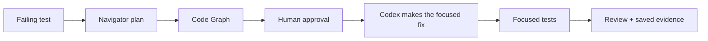

<p align="center">
  
</p>

<h1 align="center">TailTrail</h1>

<p align="center">
  <strong>Keep AI-assisted code changes focused, reviewable, and provable.</strong>
  <br />
  OpenAI Build Week 2026 · Developer Tools submission
</p>

<p align="center">
  <code>Navigator-first</code> · <code>Local-first</code> · <code>Approval-first</code> · <code>No dependencies for the demo</code>
</p>

---

## The problem

Small coding tasks should stay small. But AI-assisted changes can drift into
unnecessary rewrites, lose the actual requirement, and make it hard to show why
a change is safe.

**TailTrail adds a lightweight workflow around Codex:** first make a plan, then
map the relevant code, get approval, make the smallest fix, run focused
validation, and leave clear evidence behind.



## End-to-end workflow

The demo uses the core path. The surrounding capabilities are available when a
task needs them; TailTrail does not silently run tools, modify code, or share
data.

```mermaid
flowchart TB
    task[Developer request] --> intake

    subgraph intake[1 · Understand and scope]
        direction LR
        intent[Intent expansion] --> nav[Navigator-first plan]
        snapshot[Bootstrap Snapshot] --> nav
        token[Token routing and context slicing] --> nav
    end

    nav --> graph

    subgraph graph[2 · Map the real change]
        direction LR
        codegraph[Code Graph: symbols, callers, tests]
        semantic[Semantic V1/V2 local analysis]
        provider[Semantic V3 provider data<br/>only when explicitly approved]
        codegraph --> semantic
        semantic -. optional .-> provider
    end

    graph --> controls

    subgraph controls[3 · Keep the work safe]
        direction LR
        policy[Project policy and governance]
        guardrails[Guardrails and dependency gate]
        approval[Human approval gate]
        policy --> guardrails --> approval
    end

    approval --> change[4 · Codex makes the smallest approved change]
    change --> validate

    subgraph validate[5 · Validate and inspect]
        direction LR
        tests[Test Precision and focused tests]
        quality[Quality, CI/Sonar, and security signals<br/>only when approved]
        lenses[Review lenses: QA, security, architecture,<br/>maintainability, dependency]
        tests --> lenses
        quality --> lenses
    end

    lenses --> decision{Requirement met?}
    decision -- no --> nav
    decision -- yes --> evidence

    subgraph evidence[6 · Preserve useful proof]
        direction LR
        review[Requirement-aware review]
        eval[Evaluation Harness and benchmarks]
        value[Evidence labels and value reports]
        review --> eval --> value
    end

    evidence --> memory

    subgraph memory[7 · Reuse and hand off]
        direction LR
        learn[Approval-only learnings]
        handoff[Handoff and release hygiene]
        meta[Meta-Harness and shared metadata<br/>with explicit controls]
        learn --> handoff --> meta
    end

    adapters[Codex plugin, MCP, and assistant adapters] -. integrates with .-> intake
```

| Stage | TailTrail feature families | What stays under human control |
| --- | --- | --- |
| **Understand** | Navigator, intent expansion, Bootstrap Snapshot, token routing | Task scope and the plan. |
| **Map** | Code Graph, local semantic analysis, optional provider ingestion | Any provider-backed analysis requires explicit approval. |
| **Control** | Policy, governance, guardrails, Dependency Gate | Editing code, installing dependencies, and risky actions. |
| **Validate** | Test Precision, quality/CI/Sonar, security signals, review lenses | Which checks actually run. |
| **Prove** | Review, Evaluation Harness, benchmarks, evidence labels, value reports | What claims are made and what evidence is recorded. |
| **Improve** | Approval-only learnings, handoff, release hygiene, Meta-Harness | Capturing, sharing, or applying durable knowledge. |

### What TailTrail is

```text
+--------------------------------------------+
| TailTrail                                  |
| Navigator online. Context stays lean.      |
|                                            |
| Navigator * Code Graph * Guardrails        |
| AIDLC * Review Lenses * Test Precision     |
| Token Budget * CI/Sonar * Security         |
| Learning * Handoff * Value Reports         |
| Meta-Harness * Shared Metadata             |
+--------------------------------------------+
```

## See it in two minutes

The included `buildweek-demo-project/` is a tiny Python claims service with one
intentional bug: it accepts a zero-dollar claim even though every amount must be
positive.

| You will see | Why it matters |
| --- | --- |
| A test fail for the right reason | The starting state is honest and reproducible. |
| Navigator plan before edits | Codex gets focused context instead of an open-ended rewrite request. |
| Code Graph impact map | The demo identifies the validation code and its focused test. |
| Small approved fix and test run | The result is validated, not merely described. |
| Evaluation Harness report | Saved artifacts make the submission replayable. |

> **Demo boundary:** the initial failing test is intentional. It is the bug fixed
> during the live recording—not a broken setup.

## Judge quickstart

**Requirements:** Python 3.9+ and a shell. The deterministic judge path needs
no API key, package install, network access, database, or external scanner.

From the repository root:

```bash
# 1. Show the approval-first plan — no edits are made.
python3 tailtrail/scripts/tailtrail.py start "fix the claim amount validation bug and add focused validation" --root buildweek-demo-project --changed src/claims_api/validation.py

# 2. Map the exact implementation and test scope.
python3 tailtrail/scripts/tailtrail.py graph ast --root buildweek-demo-project --changed src/claims_api/validation.py --depth v2

# 3. Replay the committed evaluation evidence.
python3 tailtrail/scripts/tailtrail.py eval scenario report --scenario buildweek-validation
```

On Windows, use `python` instead of `python3` if needed.

### Run the demo test

```bash
cd buildweek-demo-project
python3 -m unittest discover -s tests -v
```

Before the live fix, `test_rejects_zero_amount` fails by design. After updating
`src/claims_api/validation.py` to reject `amount <= 0`, all three tests pass.

## Use it with Codex

This repository includes a Codex plugin manifest plus bundled `@tailtrail` and
`@tailtrail-review` skills. Open this repository in Codex and start the demo
with the following prompt:

```text
Run TailTrail Navigator first for this task: fix the claim amount validation bug
and add focused validation. Use root buildweek-demo-project and changed file
src/claims_api/validation.py. Show the plan only. Do not implement until I approve.
```

### How Codex and GPT-5.6 are used

| Capability | Meaningful role in the demo |
| --- | --- |
| **Codex** | Inspects the code and tests, follows the Navigator plan, implements the approved minimal fix, and runs focused validation. |
| **GPT-5.6** | Powers the live reasoning conversation: translating the request into a scoped plan, explaining impact, and reviewing requirement fulfillment. |
| **TailTrail** | Supplies local workflow structure, guardrails, code mapping, evidence labels, and deterministic evaluation artifacts. |

TailTrail does not replace Codex, human judgment, tests, CI, security review, or
scanners. Token figures are estimates unless measured provider telemetry exists.

## Repository map

| Path | Purpose |
| --- | --- |
| [`buildweek-demo-project/`](buildweek-demo-project/) | The small, reproducible claims-service demo. |
| [`tailtrail/`](tailtrail/) | Bundled runtime, skills, scripts, templates, and evaluation harness. |
| [`.codex-plugin/plugin.json`](.codex-plugin/plugin.json) | Codex plugin manifest. |
| [`assets/brand/tailtrail-mark.png`](assets/brand/tailtrail-mark.png) | TailTrail brand mark used above. |

## Submission materials

- [Project description](buildweek-demo-project/SUBMISSION-NOTES.md)
- [Submission checklist](buildweek-demo-project/BUILDWEEK-SUBMISSION.md)
- [Recording runbook](buildweek-demo-project/DEMO-RUNBOOK.md)
- [Copy-paste demo prompts](buildweek-demo-project/DEMO-PROMPTS.md)
- [Video script](PITCH-SCRIPT.md)
- [One-page overview](PITCH-ONE-PAGER.md)

## License

[Apache-2.0](LICENSE)
