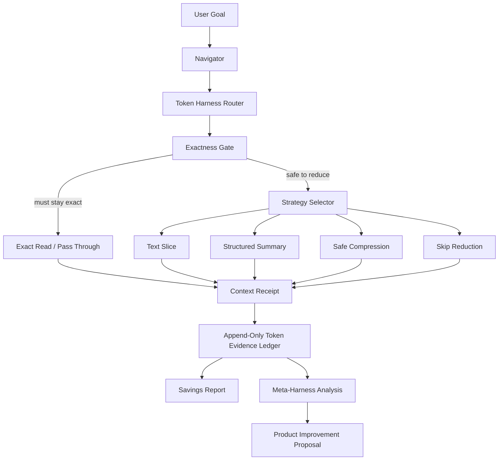

# TailTrail Token Harness

Token Harness is a planned TailTrail layer for evidence-backed token optimization. It should decide what context to load, what to avoid, what to summarize, what must remain exact, what can be safely compressed, how to prove the savings, and how to learn when token-saving choices improved or hurt engineering outcomes.

It is inspired by modern context-compression tools such as Headroom, but it should remain original to TailTrail's purpose: Navigator-first workflow control, exactness preservation, local-first evidence, and Meta-Harness-backed product improvement.

TailTrail should not become a blind compression proxy. TailTrail should become the system that knows:

- what context should be loaded
- what context should be avoided
- what context can be summarized
- what context must stay exact
- what context can be compressed safely
- what evidence proves token savings happened
- when a token-saving strategy made answers worse

## Core Thesis

Headroom-style tools are strong at runtime compression:

```text
agent output/log/file/RAG chunk -> content router -> compressor -> compressed context -> LLM
```

TailTrail's stronger position is orchestration:

```text
user goal -> Navigator -> context route -> graph/policy/test evidence -> exactness decision -> optional compression -> measured evidence -> Meta-Harness learning
```

The best TailTrail design is therefore:

```text
select less context first
compress only safe bulky context second
measure honestly always
retrieve exact originals when needed
learn centrally only from approved sanitized evidence
```

## Relevant Headroom Ideas For TailTrail

This section captures the useful product ideas observed from Headroom and translates them into TailTrail's own design language. It is not a plan to copy source code, prompts, assets, or documentation. TailTrail should implement original local tooling around its existing Navigator, Code Graph, Guardrails, Learning, Reporting, and Meta-Harness layers.

### 1. Context Reduction Should Be Content-Aware

Headroom separates different content shapes instead of treating all text as one blob. TailTrail should do the same, but through the Navigator:

- source code should usually stay exact or be represented by graph summaries
- diffs should stay exact
- logs should become failure-focused summaries
- JSON/tool output should become structural summaries
- scanner output should preserve rule IDs, severity, file, and line
- docs should be sliced by relevant sections
- learning history should be summarized through confidence gates

Design implication: TailTrail needs a Token Harness Router before any compression or summarization happens.

### 2. Compression Must Be Reversible Enough For Engineering Work

Token savings become dangerous when the agent cannot recover the original fact. TailTrail should not only create smaller context; it should also create receipts that say exactly what was reduced and how to retrieve the original evidence.

Design implication: every reduced context block should carry:

- source file or artifact
- selected strategy
- exactness class
- preserved evidence
- retrieval command or pointer
- evidence label

### 3. Zero-Compression Is A Feature, Not A Failure

Headroom's public benchmark material shows some code and grep-style content intentionally receiving no compression because preserving exactness is more important than token reduction. TailTrail should treat this as a first-class success case.

Design implication: Token Harness must be allowed to return `skip-reduction` or `exact-pass-through` with a clear reason.

### 4. Token Savings Need Proof, Not Just A Claim

Headroom's strongest product idea is not only compression; it is showing before/after token counts and a savings ledger. TailTrail already has pieces of this through reports, telemetry import, context receipts, and benchmark harness. Token Harness should unify them.

Design implication: TailTrail should report savings by evidence level:

- `estimated`: local approximation only
- `local-evidence`: deterministic local token counts plus receipts
- `measured`: user-provided real provider/model token usage
- `benchmark-measured`: controlled benchmark with measured telemetry and validation

### 5. Runtime Proxy Is Powerful But Should Stay Optional

Headroom offers runtime integration patterns such as wrapping commands, proxying requests, and MCP-style usage. TailTrail should not lead with a proxy because TailTrail's core value is workflow routing, review, graphing, guardrails, and enterprise-safe evidence.

Design implication: TailTrail can add an optional adapter boundary later, but the default path should remain local scripts and explicit Navigator decisions.

### 6. Output Tokens Matter Too

Token savings are not only about what the agent reads. Long plans, repeated explanations, verbose review output, and repeated boilerplate also consume tokens.

Design implication: TailTrail should choose response profiles:

- compact for small tasks
- standard for normal work
- detailed for risky implementation
- audit for review, security, release, and compliance work

### 7. Local-First Telemetry Builds Trust

Headroom's savings story depends on durable usage evidence. TailTrail should keep this local-first and governance-friendly: no hidden upload, no raw prompt capture, and no central sharing unless explicitly approved and sanitized.

Design implication: Token Harness should append sanitized local events that can later feed Meta-Harness summaries.

### 8. Benchmarks Must Include Correctness

A compression benchmark is weak if it only shows fewer tokens. Engineering teams need to know whether the reduced context still allowed correct code changes, accurate review findings, and passing validation.

Design implication: TailTrail's Token Harness benchmarks should always pair token evidence with quality evidence:

- did tests pass
- did review miss anything
- did scanner findings remain visible
- did the user need to retrieve exact context
- did learning capture accept or reject the pattern

## Full Token Harness Idea Bank

This section intentionally captures a broad set of ideas. Not every item should be implemented immediately. The point is to preserve the design space so we can later choose what belongs in V1, V2, enterprise rollout, benchmark mode, or optional integrations.

### A. Token Strategy Comparison

TailTrail should be able to compare multiple ways of preparing context for the same task.

Example output:

```text
Token strategy comparison:
- full read: about 18,000 tokens
- graph-first read: about 4,500 tokens
- sliced read: about 6,200 tokens
- summary read: about 2,900 tokens
- exact changed files only: about 3,100 tokens

Recommended: graph-first read plus exact changed files.
Reason: task asks for implementation review; graph gives callers/tests while exact changed files preserve correctness.
```

Design implementation:

- Add a strategy estimator to Token Harness.
- Inputs:
  - user goal
  - changed files
  - graph cache availability
  - target files
  - task type from Navigator
  - risk indicators
- Outputs:
  - candidate strategies
  - estimated tokens
  - risk of context loss
  - recommended strategy
  - reason
- Integrate into Navigator compactly:
  - show only recommended strategy in normal mode
  - show comparison table in detailed or audit mode

Why useful:

- Makes token decisions explainable.
- Helps users trust why TailTrail did not read the whole repo.
- Helps Meta-Harness later compare which strategies worked.

### B. Token Budget Guard

TailTrail should estimate whether a task is small, medium, or large before context loading.

Example:

```text
Context budget:
- estimated need: medium
- suggested budget: 8k-12k tokens
- avoid: full repo scan
- use: code graph summary, exact target files, nearby tests
- fallback: request approval before broad scan
```

Design implementation:

- Add a budget planner in `scripts/token_harness_core.py`.
- Use deterministic signals:
  - prompt length
  - number of mentioned files/repos
  - task type
  - changed file count
  - scanner/log indicators
  - AIDLC/release/security indicators
  - graph freshness
- Budget classes:
  - `tiny`: no token harness needed
  - `small`: exact file reads only
  - `medium`: graph-first plus exact files
  - `large`: graph-first plus slices/summaries
  - `audit`: exact evidence plus receipts
- Navigator should not run token planning for tiny prompts unless the prompt asks for token saving, repo overview, scan, or broad review.

Why useful:

- Prevents token tooling from costing more than it saves.
- Gives a simple early guardrail before large reads.

### C. Token Budget Drift Recovery

Initial budget estimates can be wrong. TailTrail should detect when it underestimated context need and recover safely.

Example:

```text
Budget drift detected:
- planned: medium, graph-first context
- observed: missing endpoint caller path
- action: retrieve exact caller chain and update context receipt
- learning: similar API-review prompts need endpoint graph slice
```

Design implementation:

- Track:
  - estimated budget class
  - actual context receipts
  - retrieval events
  - review findings caused by missing context
  - validation failures possibly caused by insufficient context
- If context retrieval was needed, mark:
  - `budget_fit`: `underestimated`
  - `retrieval_needed`: `true`
  - `reason`: caller/test/config/scanner evidence missing
- Feed sanitized signal into Meta-Harness.

Why useful:

- Makes token estimation improve over time.
- Avoids pretending the first estimate was always correct.

### D. Compression Safety Score

Each token-saving decision should carry a safety score or label.

Example:

```text
Reduction safety:
- label: safe
- reason: build log summarized with failing test, stack trace, command, and exit code preserved
```

Labels:

- `safe`: low chance of losing material context
- `caution`: summary may hide details; retrieval pointer required
- `risky`: exact material detected; recommend exact read
- `blocked`: reduction would violate exactness gate
- `not-needed`: input is too small or task is too narrow

Design implementation:

- Add `safety_label` to route decisions and receipts.
- Add static scoring:
  - source/diff/security config: risky or blocked
  - short text: not-needed
  - large JSON: safe if anomaly preservation passes
  - logs/scanners: caution unless exact critical lines are preserved
- Add tests for each label.

Why useful:

- Gives reviewers confidence that reduction was not blind.
- Helps enterprise policy decide which strategies are allowed.

### E. Task-Specific Compression Profiles

Different tasks need different context. TailTrail should not use one token strategy for everything.

Profiles:

| Profile | Best For | Default Context |
|---|---|---|
| `bug-fix` | localized defect | exact changed/target file, related tests, caller graph |
| `feature` | new behavior | AIDLC slice, target modules, tests, policy, dependency gate |
| `repo-overview` | understanding a repo | README, manifests, top-level graph, entry points |
| `review` | code review | exact diff, impacted callers/tests, guardrails |
| `security` | auth/data/secrets risk | exact security-sensitive files, scanner summaries, policies |
| `ci-failure` | failing pipeline/logs | failure summary, exact stack traces, related tests |
| `sonar-quality` | quality gate | scanner findings, code graph overlays, exact target files |
| `vulnerability` | CVE/dependency/container risk | vulnerability findings, package files, graph impact |
| `release` | release readiness | changelog, validation, handoff, risk notes |
| `learning-refresh` | learning cleanup | confidence summaries, conflicts, stale rules |

Design implementation:

- Add profile selection to Navigator.
- Each profile returns:
  - load list
  - avoid list
  - exactness defaults
  - token strategy
  - required validation
  - whether receipts are mandatory
- Allow local policy overrides:
  - `tailtrail-policy.md` can force exact reads for regulated folders
  - `tailtrail-policy.md` can disable compression for security paths

Why useful:

- Makes TailTrail feel intelligent without a heavy agent.
- Reduces user need to remember commands.

### F. Savings Ledger UX

TailTrail should expose a simple user-facing report, not only raw JSONL files.

Possible command:

```bash
python3 scripts/tailtrail.py token-harness report --root .
```

Possible output:

```text
Token Harness report
- events: 42
- estimated avoided tokens: 184,000
- measured saved tokens: unavailable
- top strategy: graph-first reads
- most effective strategy: scanner summary with exact findings
- highest risk strategy: long doc summary without retrieval
- recommendation: enable receipts for release tasks
```

Design implementation:

- Read Token Harness ledger.
- Group by:
  - task type
  - strategy
  - evidence label
  - validation outcome
  - retrieval needed
- Output:
  - compact table
  - JSON format for automation
  - no raw prompt/source/log content

Why useful:

- Gives users confidence.
- Helps pitch token savings honestly.
- Gives maintainers real evidence for improvements.

### G. Local Savings Ledger With Concurrency Safety

If multiple commands run, token events should not overwrite each other. Concurrency safety is **required** for Phase TH-3, not optional, because partial ledger writes silently corrupt every downstream savings claim.

Design implementation:

- Store events in `.tailtrail/token-harness-events.jsonl`.
- Use append-only writes.
- **Required** file locking:
  - POSIX: `fcntl.flock(fd, LOCK_EX)` around each append (stdlib only, no new dependency).
  - Windows: best-effort `msvcrt.locking` with a documented fallback of "single-writer per repo"; log a warning if the lock cannot be acquired.
  - Every write must open, lock, append, fsync, unlock, close in that order.
- Include schema version and monotonically increasing local sequence number so a torn write is detectable.
- Keep events sanitized:
  - no raw prompt
  - no raw source
  - no secrets
  - no user identity
  - no private repo name unless explicitly allowed
- Add compaction later:
  - monthly summary
  - raw local events retained or pruned by policy

Why useful:

- Enables reliable local reporting.
- Prevents partial evidence from corrupting claims.
- Makes parallel benchmark, harness, and Navigator runs safe from day one instead of after a data-loss incident.

### H. Provider Telemetry Import

TailTrail should accept real token usage metadata from providers or wrappers when the user has it.

Design implementation:

- Continue avoiding API calls in normal development.
- Add import adapters for:
  - generic JSON usage files
  - OpenAI-style usage metadata
  - Anthropic-style usage metadata
  - Gemini-style usage metadata
  - local benchmark exported usage
- Normalize into:

```json
{
  "provider": "example-provider",
  "model": "example-model",
  "input_tokens": 12000,
  "output_tokens": 1800,
  "cache_read_tokens": 6000,
  "cache_write_tokens": 1000,
  "total_tokens": 13800,
  "cost": null,
  "evidence_label": "measured"
}
```

Why useful:

- Moves from estimated savings to measured savings.
- Lets public claims remain honest.
- Avoids network/API dependency in daily work.

### I. Prompt Cache Awareness

Provider prompt caches can reduce cost when stable prompt prefixes stay byte-identical. TailTrail should support that without depending on one provider.

Design implementation:

- Keep stable TailTrail instruction blocks unchanged.
- Put task-specific details after stable guidance.
- Keep Navigator sections in fixed order.
- Avoid regenerating large governance text unless needed.
- Track:
  - stable context tokens
  - task-specific context tokens
  - avoided context tokens
  - cache-friendly context tokens where telemetry supports it

Why useful:

- Saves cost even when text is not compressed.
- Encourages stable docs and deterministic outputs.

### J. Context Receipts With Retrieval Commands

Every reduced context block should have a receipt.

Receipt should answer:

- what was considered
- what was loaded
- what was avoided
- what exact evidence was preserved
- how to retrieve the original
- whether the claim is estimated or measured

Design implementation:

- Extend existing context receipt support to schema v2.
- Add retrieval commands:
  - line range
  - file path
  - graph query
  - scanner finding ID
  - artifact path
- Add safety:
  - receipts store pointers, not raw sensitive content
  - receipts can be local-only

Why useful:

- Makes token saving auditable.
- Gives agents a recovery path when context is missing.

### K. JSON And Tool Output Reduction

Large JSON outputs are good candidates for structural reduction.

Design implementation:

- Parse with Python standard library.
- Preserve:
  - schema keys
  - first items
  - last items
  - anomalies
  - counts
  - status/severity summaries
  - retrieval pointer
- Avoid:
  - removing error items
  - hiding unknown fields
  - pretending approximate counts are exact

Example:

```text
JSON reduced:
- original items: 2,400
- displayed items: 31
- preserved anomalies: 18
- status counts: success=2,301, warning=81, error=18
- retrieval: original artifact path recorded in receipt
```

Why useful:

- High token saving with low correctness risk when done carefully.

### L. Logs And Build Output Reduction

Logs can be huge, repetitive, and noisy. TailTrail should summarize them around failures.

Design implementation:

- Preserve:
  - command
  - working directory if safe
  - exit code
  - failed test names
  - stack trace top and bottom
  - file/line references
  - error codes
  - final failure block
- Reduce:
  - repeated passing tests
  - repeated warnings
  - progress bars
  - duplicated stack frames
- Add validation:
  - summary must contain failure marker
  - summary must include retrieval pointer

Why useful:

- CI and test logs are one of the most practical token-saving targets.

### M. Scanner Output Reduction

Scanner output must preserve exact finding identity.

Design implementation:

- Preserve:
  - scanner name
  - scanner version if present
  - rule ID
  - severity
  - file
  - line
  - package/dependency
  - vulnerable version
  - fixed version
  - CVE/GHSA identifiers
  - confidence
- Group:
  - by severity
  - by rule
  - by package
  - by reachable code graph impact
- Support structured formats:
  - SARIF
  - Sonar JSON
  - Trivy/Grype JSON
  - dependency-check XML
  - CycloneDX/SPDX later if needed

Why useful:

- Security and quality work can use summaries without losing exact findings.

### N. Code Graph First, Exact Source Second

TailTrail already has a Code Graph Mapper. Token Harness should use it as the first context source for broad understanding.

Design implementation:

- For overview/review/security prompts:
  - check graph cache first
  - confirm graph freshness
  - load graph summary
  - load exact source only for target files, impacted callers, tests, endpoints, tables, or config
- If graph is stale:
  - update graph before broad reads when approved
  - mark token receipt as graph-generated

Why useful:

- Avoids full repo reads.
- Gives agents structure faster.
- Keeps exact file reads focused.

### O. Learning Summaries Instead Of Raw History

TailTrail learning can become large and noisy. Token Harness should never load raw learning history by default.

Design implementation:

- Load:
  - high-confidence matching learnings
  - matching tags/files/rules
  - conflict warnings
  - stale indicators
- Avoid:
  - raw prompt history
  - low-confidence rejected learnings
  - unrelated repo memories
- Add learning receipt:
  - matched rules
  - skipped rules
  - confidence range
  - conflict status

Why useful:

- Keeps learning helpful without creating token bloat.

### P. Output Token Profiles

TailTrail should optimize output length based on task.

Profiles:

- `compact`: small task, short answer, no table unless useful
- `standard`: normal implementation or review summary
- `detailed`: complex or multi-file planning
- `audit`: regulated/security/release/scanner evidence
- `pitch`: demo or stakeholder explanation

Design implementation:

- Navigator chooses default response profile.
- User can override:
  - `compact`
  - `detailed`
  - `audit mode`
- Reports should include:
  - output profile used
  - reason
  - whether details were intentionally skipped

Why useful:

- Reduces output tokens.
- Makes user experience less noisy.

### Q. Token-Aware Review Findings

Review output can become verbose. Token Harness should help review show enough detail without dumping everything.

Design implementation:

- Default review output:
  - severity
  - one-line issue
  - file
  - function/symbol if known
  - line number
  - fix direction
- Detailed mode:
  - add rationale
  - add affected tests
  - add related graph paths
  - add exact snippets only where necessary
- Avoid:
  - repeating full diffs
  - broad prose for every finding

Why useful:

- Keeps review actionable and cheaper.

### R. Token-Aware AIDLC

AIDLC can create multiple docs. Token Harness should load only the active slice.

Design implementation:

- Read `aidlc-state.md` first.
- Load only the active lifecycle section.
- Summarize completed phases.
- Preserve current decisions, requirements, validation, and open questions exactly.
- Avoid loading all generated lifecycle docs unless the user asks for full audit.

Why useful:

- Keeps lifecycle useful without making every prompt expensive.

### S. Token-Aware Handoff

Handoff should produce compact but complete transfer context.

Design implementation:

- Handoff summary includes:
  - goal
  - files changed
  - decisions made
  - validation run
  - risks
  - next actions
  - receipts for reduced context
- Avoid:
  - full conversation replay
  - raw logs unless failure evidence is required

Why useful:

- Makes work resumable with fewer tokens.

### T. Token-Saving Failure Detection

TailTrail should detect when token saving likely hurt the result.

Signals:

- user says context was missing
- review finds requirement mismatch
- validation fails due to overlooked caller/test/config
- exact retrieval was needed repeatedly
- learning capture rejects the result
- Meta-Harness finds same strategy causing repeated failures

Design implementation:

- Add `token_saving_failure_reason` to Meta-Harness summaries.
- Add analyzer findings:
  - strategy underloaded callers
  - strategy skipped scanner detail
  - output profile too compact
  - learning summary hid conflict
  - graph stale but used as fresh

Why useful:

- Prevents token saving from becoming a silent quality risk.

### U. Token Harness Quality Score

Each task can get a post-task token-quality summary.

Example:

```text
Token quality:
- budget fit: good
- exactness: preserved
- retrieval needed: no
- validation fit: pass
- savings evidence: local-evidence
- confidence: 82/100
```

Design implementation:

- Score inputs:
  - exactness class honored
  - validation outcome
  - review outcome
  - retrieval needed
  - measured/local token reduction
  - user acceptance
- Use ranges:
  - `0-39`: strategy failed or unsafe
  - `40-59`: weak; show as caution
  - `60-79`: usable; improve if repeated
  - `80-100`: trusted for similar tasks

Why useful:

- Helps governance.
- Gives Meta-Harness a cleaner improvement signal.

### V. Benchmark Scenarios For Token Harness

TailTrail should benchmark token strategy and correctness together.

Suggested scenarios:

- noisy test log with one failing test
- large JSON tool output with hidden error items
- SARIF file with critical and low findings
- repo overview using graph-first context
- code review with exact diff plus graph callers
- AIDLC lifecycle resume from active state only
- security review where exact config must not be compressed
- vulnerability scan where CVE/fixed version must survive

Design implementation:

- Add fixtures under benchmark test data.
- Run before/after strategy:
  - baseline: broad/raw context
  - TailTrail: routed context
- Measure:
  - local token count
  - exact evidence preserved
  - expected answer quality
  - validation pass/fail

Why useful:

- Gives credible demo and product proof.

### W. Runtime Compression Adapter Boundary

TailTrail should optionally connect to external reducers later, but only behind a strict adapter contract.

Design implementation:

- Adapter input:
  - content type
  - exactness class
  - original artifact path
  - allowed reduction strategy
  - required preserved evidence
- Adapter output:
  - reduced artifact path
  - token before/after
  - preserved evidence list
  - retrieval pointer
  - validation status
- TailTrail validates adapter output.
- If validation fails:
  - discard reduced output
  - fall back to exact or internal summary
  - record failure

Why useful:

- Allows future innovation without locking TailTrail to one compressor.

### X. Optional MCP Or Proxy Mode

Runtime MCP/proxy mode can be powerful, but it is a later-stage feature.

Possible use:

- intercept tool output
- route logs/JSON/scanner output through Token Harness
- emit context receipts automatically
- send compact context back to the agent

Risks:

- harder debugging
- hidden behavior if not designed carefully
- extra latency
- more installation complexity
- harder enterprise approval

Design decision:

- Keep this as optional future work.
- Do not make it default.
- Require clear local config and visible receipts.

### Y. Enterprise Policy Controls

Enterprise users need policy control over token saving.

Policy examples:

```text
token_harness:
  disabled_paths:
    - security/**
    - compliance/**
  require_exact:
    - "**/*.tf"
    - "**/pom.xml"
    - "**/package-lock.json"
  allow_json_reduction: true
  allow_log_summary: true
  allow_external_adapter: false
  require_receipts_for:
    - review
    - security
    - release
```

Design implementation:

- Extend `tailtrail-policy.md` schema.
- Policy can only make token saving stricter, not weaker than global guardrails.
- Navigator displays policy constraints in audit mode.

Why useful:

- Makes TailTrail deployable in regulated teams.

### Z. Team And Central Meta-Harness Aggregation

Token Harness evidence should feed central improvement only through approved sanitized summaries.

Design implementation:

- Local task event stays local by default.
- Shared summary may include:
  - strategy
  - content type
  - evidence label
  - token counts
  - validation outcome
  - failure reason
  - no raw prompt/source/log
- Central Meta-Harness can propose:
  - router rule changes
  - exactness gate changes
  - benchmark fixture additions
  - documentation updates
  - policy defaults

Why useful:

- Lets TailTrail improve across teams without leaking code.

### AA. Token Harness Doctor

TailTrail should include a health check for token-saving setup.

Possible command:

```bash
python3 scripts/tailtrail.py token-harness doctor --root .
```

Checks:

- graph cache exists and freshness is known
- token ledger is writable
- receipts directory exists
- policy does not conflict with token settings
- telemetry import files are local-only
- public claims are guarded
- external adapter disabled unless configured

Why useful:

- Reduces setup confusion.
- Gives quick confidence that Token Harness is ready.

### AB. Token Harness Dry Run

Before reading large context, TailTrail should support a dry run.

Example:

```bash
python3 scripts/tailtrail.py token-harness dry-run --goal "review auth changes" --root .
```

Output:

```text
Dry run:
- task type: security review
- strategy: exact diff + graph callers + scanner summary
- will not read: full repo, roadmap, old learnings
- will create: context receipt
- needs approval: vulnerability scan
```

Why useful:

- Lets users see the plan before spending tokens or running scans.

### AC. Token Harness Explain Mode

Users should be able to ask why TailTrail selected a strategy.

Example:

```text
Why did TailTrail skip compression?
Because the requested file is a dependency manifest and exact versions must be preserved.
```

Design implementation:

- Every decision has:
  - rule ID
  - reason
  - evidence
  - override availability
  - risk label

Why useful:

- Builds trust.
- Helps debugging.

### AD. Token Harness Override Flow

Users may need to override TailTrail.

Rules:

- User can request exact read even if summary was recommended.
- User can request compact summary if policy allows.
- User cannot override global safety rules through normal prompts.
- Override should be recorded as local event.

Example:

```text
User override:
- requested: exact read
- previous recommendation: structured summary
- action: exact read allowed
- reason: user wants full audit
```

Why useful:

- Keeps users in control without weakening safety.

### AE. Token Harness Product Metrics

For demos and enterprise review, TailTrail should show high-level metrics.

Possible metrics:

- estimated tokens avoided
- measured tokens saved when available
- tasks using graph-first context
- tasks using exact pass-through
- tasks where reduction was skipped for safety
- validation pass rate by strategy
- review issue rate by strategy
- retrieval-needed rate
- user acceptance rate

Design implementation:

- Add to value reports.
- Use evidence labels.
- Do not claim global ROI from local estimates.

Why useful:

- Makes product value visible.
- Keeps claims honest.

### AF. Token Harness Anti-Patterns

The design should explicitly reject some ideas for now.

Avoid:

- compressing source code by default
- summarizing diffs for review
- hiding exact scanner findings
- compressing policy/security rules
- storing raw prompts in central metadata
- making token saving invisible
- claiming exact savings from estimates
- adding a background proxy before local workflow is stable
- optimizing tokens at the cost of tests or security

Why useful:

- Prevents feature drift.
- Gives maintainers a clear decision boundary.

## What TailTrail Should Learn

| Headroom Idea | TailTrail Translation | Why It Matters |
|---|---|---|
| Content-aware routing | Route logs, JSON, source, docs, scanner output, and metadata differently. | Avoids one-size-fits-all compression that can damage correctness. |
| Reversible compression | Keep summaries with exact-source pointers and retrieval commands. | Token saving does not become information loss. |
| Durable savings ledger | Append-only token evidence events. | Enables honest over-time savings reports. |
| Proof-first benchmarks | Before/after token counts plus accuracy/validation checks. | Prevents weak ROI claims. |
| Zero-compression rule | Some content should not be compressed. | Preserves code, diffs, configs, IDs, hashes, and security rules. |
| Output token shaping | Reduce unnecessary assistant verbosity. | Saves output tokens without hiding evidence. |
| Cache-friendly context | Keep stable prefixes and avoid rewriting static context. | Helps provider prompt caches and reduces repeated context cost. |
| MCP/proxy optionality | Runtime integrations should be opt-in. | Keeps TailTrail local/simple by default. |

## Design Principles

- **Text slice first**: TailTrail should avoid loading unnecessary material before compressing anything.
- **Exactness wins**: source code, diffs, configs, commands, dependency versions, logs needed for diagnosis, security rules, IDs, hashes, and policy text stay exact.
- **Reversible by design**: compressed/summarized context should point to the original file, section, command output, or artifact.
- **Evidence-labeled metrics**: every saving claim must be `estimated`, `local-evidence`, or `measured`.
- **No hidden capture**: token events require explicit local operation or approved automation.
- **No central upload by default**: central Meta-Harness uses only approved sanitized summaries.
- **No model/API runner in normal work**: optional benchmark mode can be added later, but normal local development should not call provider APIs just to prove savings.

## Proposed Architecture



## Feature 1: Content-Aware Token Router

### Purpose

Choose the correct token-saving strategy based on content type and task risk.

### Supported Content Families

| Content | Default Strategy | Notes |
|---|---|---|
| Source code | exact read or graph summary | Do not compress code by default. |
| Git diff | exact pass-through | Diffs are exact evidence. |
| Config/policy/security text | exact pass-through | Exactness matters. |
| Build/test logs | structured summary with exact pointers | Keep failing lines, stack traces, commands, exit codes. |
| Sonar/scanner output | structured parser or summary | Preserve rule IDs, file, line, severity. |
| JSON/tool output | safe structural reduction | Keep schema, first/last items, anomalies, counts. |
| Large docs | section slice or summary | Preserve headings and source links. |
| TailTrail roadmap/release docs | avoid unless task requires | Most coding tasks do not need these. |
| Code graph metadata | compact graph summary | Use cached graph first, exact files on demand. |
| Learning history | confidence-gated summary | Avoid raw history in normal prompts. |

### Implementation Plan

1. Add `scripts/token-harness.py`.
2. Add subcommands:

```bash
python3 scripts/tailtrail.py token-harness route --file build.log --goal "fix failing test"
python3 scripts/tailtrail.py token-harness route --content-type json --source tool-output.json
python3 scripts/tailtrail.py token-harness route --changed src/service/foo.py --goal "review auth change"
```

3. Implement content detection using deterministic signals:
   - extension
   - filename patterns
   - first lines
   - JSON parseability
   - known scanner markers
   - stack trace markers
   - diff markers
4. Return a decision:

```json
{
  "content_type": "build-log",
  "exactness": "partial-exact",
  "strategy": "structured-summary",
  "must_preserve": ["command", "exit_code", "failing_test", "stack_trace", "file_line"],
  "avoid": ["full passing test list", "repeated warnings"],
  "reason": "Build logs can be summarized if failure evidence is preserved."
}
```

5. Wire into Navigator for log/scanner/token-heavy prompts.
6. Add tests for source, diff, config, JSON, logs, scanner output, and docs.

### Acceptance Check

- Source code and diffs are not compressed by default.
- JSON/log/scanner output gets a reduction strategy.
- The router explains why the selected strategy is safe.
- The router can say `skip-reduction` when exactness or small size makes reduction unnecessary.

## Feature 2: Exactness Gate

### Purpose

Prevent token saving from hiding facts that matter.

### Exactness Classes

| Class | Meaning | Examples |
|---|---|---|
| `must-be-exact` | Never summarize/compress unless user explicitly asks. | code, diffs, configs, security rules, dependency versions, commands, IDs, hashes |
| `partial-exact` | Summarize but preserve critical exact lines. | logs, scanner results, stack traces |
| `summary-ok` | Summary is acceptable with pointers. | long docs, historical notes |
| `compress-ok` | Structural compression is acceptable. | bulky JSON arrays, repetitive tabular output |
| `skip` | Too small or not worth processing. | short prompt, small file |

### Implementation Plan

1. Add `ExactnessDecision` dataclass in `scripts/token_harness_core.py`.
2. Add `classify_exactness(path, content, goal)`.
3. Add static rule file or table:

```text
must-be-exact:
  *.diff, *.patch, package-lock.json, pom.xml, build.gradle, *.tfstate
partial-exact:
  *.log, sonar*.txt, trivy*.json, junit*.xml
summary-ok:
  *.md, *.rst, docs/*
compress-ok:
  large JSON arrays, generated reports, tabular exports
```

4. Integrate with:
   - `scripts/summarize-output.py`
   - `scripts/sonar-summary.py`
   - `scripts/vulnerability-summary.py`
   - `scripts/context-receipt.py`
   - `scripts/token-savings.py`

### Acceptance Check

- Exact materials are protected.
- Reductions include a preservation list.
- Tests prove exactness gate blocks compression for code, diffs, config, policy, and hashes.

## Feature 3: Reversible Context Receipts

### Purpose

Make reduced context retrievable. TailTrail should be able to say:

```text
Loaded summary of build.log lines 1-40, preserved failure lines 312-340.
Original available at /path/build.log.
Retrieve exact lines with: sed -n '312,340p' build.log
```

### Receipt Shape

```json
{
  "type": "tailtrail-context-receipt",
  "schema_version": "2",
  "task_id": "local-2026-07-17-001",
  "source": "build.log",
  "strategy": "structured-summary",
  "exactness": "partial-exact",
  "loaded_tokens": 1200,
  "original_tokens": 9800,
  "avoided_tokens": 8600,
  "preserved_evidence": [
    {"kind": "command", "value": "mvn test"},
    {"kind": "exit_code", "value": "1"},
    {"kind": "line_range", "value": "312-340"}
  ],
  "retrieval": [
    "sed -n '312,340p' build.log"
  ],
  "evidence_label": "local-evidence"
}
```

### Implementation Plan

1. Extend `scripts/context_receipt.py` to schema v2.
2. Keep v1 compatibility.
3. Add retrieval pointer fields:
   - file path
   - line range
   - artifact ID
   - command to reproduce
4. Add `python3 scripts/tailtrail.py receipt retrieve --id ...` later if needed.
5. Do not store raw content in the receipt.

### Acceptance Check

- Receipts prove what was loaded, avoided, and preserved.
- Receipts do not contain raw sensitive content.
- A reviewer can retrieve exact evidence when needed.

## Feature 4: Append-Only Token Evidence Ledger

### Purpose

Make token savings durable, auditable, and concurrency-safe.

TailTrail currently has token telemetry and context receipts. Token Harness should unify the proof path around an append-only ledger.

### Planned Ledger

```text
.tailtrail/token-harness-events.jsonl
```

### Event Types

| Event | Purpose |
|---|---|
| `route_decision` | Records selected strategy without raw content. |
| `context_receipt` | Records loaded/avoided/preserved context. |
| `measured_usage` | Records user-provided model/API usage. |
| `savings_report` | Records generated report summary. |
| `quality_result` | Records whether reduced context still passed validation. |

### Event Shape

```json
{
  "schema_version": "1",
  "event_type": "context_receipt",
  "created_at": "2026-07-17T00:00:00Z",
  "task_type": "bug-fix",
  "content_type": "build-log",
  "strategy": "structured-summary",
  "exactness": "partial-exact",
  "tokens_before": 9800,
  "tokens_after": 1200,
  "tokens_saved": 8600,
  "evidence_label": "local-evidence",
  "validation_outcome": "pass",
  "privacy": "No raw prompt, source, log, path, secret, repo name, or user identity."
}
```

### Implementation Plan

1. Add `scripts/token-harness-ledger.py` or integrate into `scripts/token-harness.py`.
2. Append JSONL events only after explicit approved operations.
3. Use file locking where available.
4. Add retention/compaction only after file growth becomes real.
5. Update `setup-scan.py` and gitignore templates to keep ledger local-only.
6. Add `tailtrail report value` integration.

### Acceptance Check

- Ledger survives process restarts.
- Multiple commands can append without losing records.
- Reports aggregate the ledger without loading raw context.
- Ledger is local-only by default.

## Feature 5: Measured Savings Proof Mode

### Purpose

Improve TailTrail's savings credibility by separating:

- context reduction estimate
- local evidence
- measured model/API telemetry
- benchmark proof

### Proof Levels

| Label | Meaning |
|---|---|
| `estimated` | Based on local character/token approximation. |
| `local-evidence` | Based on receipts and deterministic local token counting. |
| `measured` | Based on real provider/model usage metadata supplied by user or benchmark. |
| `benchmark-measured` | Based on committed before/after benchmark fixture with measured telemetry. |

### Implementation Plan

1. Extend `scripts/token-savings.py` and `scripts/efficacy-run.py` to read Token Harness ledger events.
2. Report both:
   - reduction achieved
   - validation/quality outcome
3. Add CLI:

```bash
python3 scripts/tailtrail.py token-harness proof report --root .
python3 scripts/tailtrail.py token-harness proof report --telemetry .tailtrail/token-usage.jsonl
python3 scripts/tailtrail.py efficacy run --token-harness-ledger .tailtrail/token-harness-events.jsonl
```

4. Do not use measured language unless real usage telemetry exists.
5. Add public-claim guardrails for new wording.

### Acceptance Check

- Reports never label estimates as measured.
- A report can explain why a measured claim is unavailable.
- Benchmark proof includes both token evidence and task-quality evidence.

## Feature 6: Safe Structural Reduction For JSON And Tool Output

### Purpose

Large JSON arrays and tool outputs are often token-heavy and repetitive. TailTrail can safely reduce them if it preserves schema, anomalies, counts, and retrieval pointers.

### Strategy

For JSON arrays:

- preserve first N items for schema
- preserve last N items for recency
- preserve items with error/warn/fail/exception/security markers
- preserve counts by key/status/severity
- summarize repeated shapes
- include retrieval pointer to original file/artifact

### Output Example

```text
JSON tool output reduced:
- original items: 1,000
- displayed items: 22
- preserved: first 5, last 5, 12 anomaly items
- status counts: success=948, warning=37, error=15
- retrieve original: tailtrail token-harness retrieve abc123
```

### Implementation Plan

1. Add deterministic JSON reducer in `scripts/token_harness_json.py`.
2. Keep it stdlib-only.
3. Support JSON object, JSON array, JSONL.
4. Detect anomaly keys/values:
   - error
   - warning
   - failed
   - exception
   - denied
   - vulnerability
   - critical
5. Add tests with large arrays and embedded failures.

### Acceptance Check

- Schema and anomalies survive reduction.
- Counts are correct.
- Original can be retrieved.
- Small JSON is not reduced unnecessarily.

## Feature 7: Log And Scanner Evidence Compressor

### Purpose

Logs and scanner outputs should be summarized, but exact failing lines and rule IDs must survive.

### Preservation Rules

Always preserve:

- command
- exit code
- failing test
- stack trace top/bottom
- file path and line number
- scanner rule ID
- severity
- package/dependency name and version
- CVE/GHSA IDs
- Sonar rule key

### Implementation Plan

1. Extend existing:
   - `scripts/summarize-output.py`
   - `scripts/ci-summary.py`
   - `scripts/sonar-summary.py`
   - `scripts/vulnerability-summary.py`
2. Add Token Harness receipt output to each.
3. Add structured parser outputs for:
   - SARIF
   - Sonar JSON
   - Trivy/Grype JSON
   - dependency-check XML
4. Add quality validation:
   - summary must contain all critical findings
   - summary must include exact retrieval pointer

### Acceptance Check

- Critical scanner findings are never dropped.
- Summaries include exact file/line/rule evidence.
- Token savings report includes validation status.

## Feature 8: Output Token Discipline

### Purpose

Token saving is not only about input context. Assistant output also consumes tokens.

TailTrail should reduce output waste by choosing the right response shape:

- compact Navigator plan for simple tasks
- detailed plan only when requested or risky
- compact review findings unless detailed mode is needed
- no repeated code unless asked
- no broad explanation after routine successful checks

### Implementation Plan

1. Add response-shape profiles:
   - `compact`
   - `standard`
   - `detailed`
   - `audit`
2. Add Navigator output-size decision:

```json
{
  "response_profile": "compact",
  "reason": "small bug fix with one changed file"
}
```

3. Add `tailtrail start --compact|--detailed` consistency.
4. Extend `task-start.py` and `navigator_render.py`.
5. Add tests for tiny task, broad task, scanner task, release task.

### Acceptance Check

- Tiny tasks produce compact plans.
- Risky tasks still include enough detail.
- Output reductions do not hide approvals, validation, risk, or required questions.

## Feature 9: Cache-Friendly TailTrail Context

### Purpose

Provider prompt caches work better when stable context stays byte-identical. TailTrail can help by keeping repeated guidance stable and moving task-specific details later.

### Strategy

- Keep `AGENTS.md`, governance block, and adapter instructions stable.
- Put task-specific details after stable guidance.
- Avoid rewriting stable headers in generated plans.
- Use fixed section order for Navigator output.
- Use short stable labels for recurring evidence blocks.

### Cache Ordering Invariant

Provider prompt caches (Anthropic prompt caching, OpenAI cached prompts, Bedrock) key on a **byte-identical prefix**. TailTrail context must be assembled in a way that keeps that prefix stable across turns and across similar tasks:

```text
[ stable prefix ]   governance block, guardrail layers, adapter instructions,
                    active TailTrail slice header, static policy references
                    -> must be byte-identical across turns and across tasks
                       of the same class; no timestamps, no random ordering,
                       no rewrites, no per-task substitution

[ shared middle ]   Navigator plan header, selected workflow labels,
                    graph cache identity (path + sha), profile identity
                    -> may change between tasks but must stay stable within
                       a task's turns; deterministic ordering

[ task-varying tail ] changed files, exact diffs, scanner evidence, user goal,
                      per-turn observations, retrieval receipts
                      -> the only region that varies within a task
```

Rules:

- Never insert timestamps, run IDs, or random UUIDs into the prefix or middle.
- Never reorder the prefix based on task classification; classification affects the tail only.
- When TailTrail must add a new field, add it to the tail, then promote to middle only after usage stabilizes.
- Sync-governance and adapter-sync tools must preserve byte-for-byte identical headers across generated copies.

### Implementation Plan

1. Add `context/cache-friendly-prompts.md`.
2. Add check in `sync-governance.py` or `check-tailtrail.py` for stable governance block drift.
3. Add Navigator rendering tests that preserve section order.
4. Add docs for prompt-cache-safe output.

### Acceptance Check

- Stable guidance changes only intentionally.
- Navigator output section order remains deterministic.
- Token reports can distinguish avoided context from cache-friendly stable context.

## Feature 10: Optional Runtime Compression Bridge

### Purpose

TailTrail can integrate with approved local runtime compression tools through a strict adapter boundary. This is optional, disabled by default, and approval-first.

### Design

TailTrail exposes an adapter boundary, not a bundled compressor or proxy.

```text
TailTrail Token Harness
  -> route through exactness gate
  -> block protected exact content
  -> build adapter input JSON
  -> optional local adapter
  -> validate adapter output
  -> accept compressed output or fall back safely
```

### Adapter Contract

Input and output contracts are defined in:

- `schemas/token-harness-bridge-input.schema.json`
- `schemas/token-harness-bridge-output.schema.json`

Adapter input shape:

```json
{
  "schema_version": "1",
  "type": "tailtrail-token-harness-bridge-input",
  "content_type": "log",
  "exactness_class": "reduce-safe",
  "strategy": "failure-focused-summary",
  "blocked_reductions": ["drop exit codes", "drop command names", "drop first failure"],
  "preserve": ["retrieval pointer", "command boundaries", "exit codes", "first failure"],
  "retrieval": {
    "command": "cat \"build.log\""
  },
  "input": {
    "kind": "path",
    "path": "build.log",
    "text": "..."
  }
}
```

Adapter output must preserve content type, exactness class, retrieval command, required preserved evidence, and blocked-reduction acknowledgement.

### Commands

```bash
python3 scripts/tailtrail.py token-harness bridge plan --path build.log
python3 scripts/tailtrail.py token-harness bridge input --path build.log --output /tmp/bridge-input.json
python3 scripts/tailtrail.py token-harness bridge validate-output --input /tmp/bridge-input.json --output /tmp/bridge-output.json
python3 scripts/tailtrail.py token-harness bridge run --path build.log --adapter-command "local-compressor --stdin" --approved
```

### Acceptance Check

- TailTrail works without external tools.
- External compression cannot bypass exactness gate.
- Adapter failure falls back safely.
- Protected exact content never reaches the adapter.
- The adapter command is local-only and does not run through a shell.

## Feature 11: Token Harness And Meta-Harness Feedback Loop

### Purpose

Meta-Harness should learn which token-saving strategies actually help.

### Signals

| Signal | Meaning |
|---|---|
| `strategy_selected` | Which token-saving strategy was used. |
| `tokens_saved` | Local or measured savings. |
| `validation_outcome` | Whether task validation passed. |
| `review_outcome` | Whether review found missing context. |
| `retrieval_needed` | Whether compressed context required exact retrieval. |
| `user_acceptance` | Whether user accepted the result. |
| `failure_reason` | If token saving hurt the task. |

### Implementation Plan

1. Extend `tailtrail-meta/harness-summary.jsonl` with sanitized Token Harness fields:
   - `token_strategy`
   - `token_evidence_label`
   - `token_budget_fit`
   - `retrieval_needed`
   - `validation_fit`
2. Extend `meta-harness-analyze.py` with token strategy findings:
   - strategy saved tokens and validation passed
   - strategy saved tokens but review found missing context
   - strategy was skipped correctly
   - strategy was overused
3. Add central proposal types:
   - tune content router
   - tighten exactness gate
   - change Navigator trigger
   - add benchmark scenario
4. Add tests with synthetic summaries.

### Acceptance Check

- Token-saving strategies can improve over time.
- Bad compression choices do not get productized.
- Central TailTrail can recommend better token rules from approved sanitized evidence.

## Feature 12: Holdout Measurement Protocol

### Purpose

The single strongest defense against overclaiming savings is a **control group**. Estimates use models of what would have happened; measurements compare a real unshaped subset to a real shaped subset from the same workload. This feature makes that comparison a first-class TailTrail capability instead of a manual step.

This directly extends BL-1 (Measured Efficacy Proof) and Feature 5 (Measured Savings Proof Mode) by giving them the concrete protocol that lets `measured` claims survive scrutiny.

### Protocol

- Default holdout rate: `10%` of eligible tasks (configurable per repo).
- Selection is deterministic: hash `(repo_id, task_id, holdout_salt)` and treat the lowest N% as unshaped.
- Unshaped runs skip Token Harness reductions but keep guardrails, Navigator, and receipts.
- Both shaped and unshaped runs write to the ledger with an explicit `holdout: true|false` flag.
- Sensitive task classes (`security`, `release`, `vulnerability`, `regulated`) are **excluded from the holdout** and always run shaped, because withholding governance on those is not acceptable.
- Users can force `--no-holdout` or `--holdout` on any single run for reproducibility.

### Report Shape

```text
Token Harness holdout comparison (2026-07)
- shaped runs:    412 (baseline avg 18,300 tokens -> after 9,150; -50.0%)
- unshaped runs:   47 (baseline avg 18,110 tokens; control group)
- delta:          -49.6%   95% CI [-46.1%, -53.1%]   [measured]
- excluded task classes: security, release, vulnerability
- confidence: high (n_shaped>=100, n_unshaped>=30, CI width <10 percentage points)
```

If any of the confidence gates fail, the report label drops to `local-evidence` or `estimated` with the explicit reason.

### Implementation Plan

1. Add `--holdout-rate` and `--holdout-salt` to Token Harness.
2. Add `holdout: bool`, `holdout_reason: str`, and `excluded_task_class: str | null` fields to the ledger schema.
3. Add `python3 scripts/tailtrail.py token-harness holdout report` producing shaped vs unshaped comparison with CI.
4. Add deterministic tests: same input -> same holdout selection; sensitive classes never picked.
5. Wire the CI confidence gate into value reports so `measured` never appears without meeting it.
6. Document the protocol in `benchmarks/efficacy/README.md` and cross-link from Feature 5.

### Acceptance Check

- A user can enable holdout with one flag or policy line.
- Reports label `measured` only when sample sizes and CI width thresholds pass.
- Sensitive task classes never appear in the unshaped group.
- Selection is reproducible from the deterministic salt + task id.

## Feature 13: AST-Preserving Code View

### Purpose

Between "exact source" and "graph summary" there is a valuable middle representation: **imports + top-level declarations + signatures + doc comments preserved, function bodies elided with a retrieval pointer**. This lets a wide sweep (repo overview, dependency review, architecture review) touch many files at low token cost while keeping enough exact detail for the agent to know what to retrieve for the fix.

This complements Feature 2 (Exactness Gate) and Feature 6 (Structural Reduction). It is a distinct exactness class: `structure-exact`.

### Behavior

- Preserved verbatim:
  - all import/using/require statements
  - all top-level class / interface / trait / enum / type declarations
  - all method and function signatures with return types and parameter types
  - all decorators and annotations
  - all doc comments attached to preserved declarations
  - all constants and top-level configuration values
- Elided with a retrieval pointer:
  - function/method bodies
  - inline private helpers
  - large literal blocks
- Every elided region records a receipt: file, symbol, line range, byte range, retrieval command.
- Language coverage matches Code Graph Mapper's Level 1: Python, Java, .NET/C#, SQL (structure only), Terraform.
- Falls back to `slice` view when the parser cannot produce a safe structure map.

### Example Output

```text
// src/service/PaymentValidator.java
package com.acme.payment;

import com.acme.validation.ValidationRule;
import com.acme.validation.ValidationResult;

/** Validates payment claim amounts before submission. */
public class PaymentValidator {
    public ValidationResult validate(Claim claim) { /* body elided: 42 lines, retrieve with `tailtrail engine slice-context --file src/service/PaymentValidator.java --symbol PaymentValidator.validate` */ }
    private ValidationResult applyRule(ValidationRule rule, Claim claim) { /* body elided: 18 lines */ }
    public static PaymentValidator forCurrency(String currency) { /* body elided: 6 lines */ }
}
```

### Implementation Plan

1. Add `ast_preserving_view()` to `scripts/ast-map.py` (reuse existing parsers).
2. Add `python3 scripts/tailtrail.py engine ast-view --file <path>` and `--symbol` retrieval.
3. Register `structure-exact` as an exactness class in Feature 2.
4. Add token savings measurement per file (bytes preserved vs elided).
5. Add tests: signature preservation, doc comment preservation, retrieval pointer correctness, parser-failure fallback.
6. Wire into Navigator profiles for `repo-overview`, `dependency`, and `architecture` tasks.

### Acceptance Check

- Structure-exact view preserves imports, signatures, and doc comments byte-identical.
- Every elided region has an actionable retrieval pointer.
- Parser failure falls back to slice view without crashing the caller.
- Repo overview token cost drops materially without losing top-level API surface.

## Feature 14: Response Shape Profiles For TailTrail Output

### Purpose

Token discipline (Feature 8) targets what the agent writes. This feature targets what **TailTrail itself** writes: Navigator plans, Start reports, review findings, harness reports, enterprise reports. All are user-visible Markdown consumed by an assistant on the next turn, so their size directly affects context budget.

### Profiles

| Profile | Used For | Behavior |
|---|---|---|
| `compact` | tiny tasks, resumed sessions, next-step nudges | one-line summary + one action, no decision menu, no evidence blocks |
| `standard` | normal Navigator plans, Start reports | current default output |
| `detailed` | risky implementation, dependency, security, release | full plan, full evidence blocks, verbose approval choices |
| `audit` | review, security review, compliance, release readiness | detailed + verbatim source references, verbatim rule IDs, verbatim commands, verbatim policy quotes |

### Selection Rules

- Navigator picks the profile deterministically from task class and risk indicators.
- Users can override with `--shape compact|standard|detailed|audit` on any TailTrail command that emits Markdown.
- `audit` is sticky per session for regulated workflows; downgrading requires an explicit flag.
- Every TailTrail report includes its chosen profile in the machine-readable payload.

### Implementation Plan

1. Add a `response_shape` field to Navigator's decision output.
2. Add `--shape` to `tailtrail.py start|guide|review|harness|report`.
3. Add profile-aware renderers alongside existing Markdown renderers (do not fork the report logic).
4. Add golden tests for each profile per command (extend `tests/golden/`).
5. Add compact-profile bytes vs standard-profile bytes to the harness value report.
6. Document in `USER-GUIDE.md` and `QUICKSTART.md` with recommended defaults.

### Acceptance Check

- Compact profile output stays under a documented byte budget for the covered commands.
- Audit profile preserves exact rule IDs, commands, policy quotes, and source references.
- Downgrading from `audit` requires an explicit user action.
- Value reports quantify TailTrail-side token discipline separately from assistant-side.

## Feature 15: Assistant Wrap Adapters

### Purpose

The single biggest UX win in the Headroom ecosystem is `wrap <agent>`: users type nothing extra and their assistant automatically benefits. TailTrail should not run a runtime proxy (see Feature 10 and the tightened non-goals), but it can give the same one-command experience with a small, safe adapter contract that injects Navigator plans and guardrail reminders into each assistant's instruction surface.

This is not a proxy. It is a **preamble injection contract**: TailTrail writes a compact preamble to each supported assistant's instruction file (or environment-configured entry) so a Navigator plan appears before the user's first turn without any manual command.

### Design

- One command: `python3 scripts/tailtrail.py wrap <assistant>`.
- Supported targets on day one: `copilot`, `claude`, `cursor`, `codex`, `gemini`, `chatgpt`.
- What it does:
  - Detects the assistant's instruction path (already known by existing adapters).
  - Renders a compact preamble using the `compact` response shape (Feature 14).
  - Inserts the preamble between `<!-- tailtrail-wrap:start -->` and `<!-- tailtrail-wrap:end -->` markers so it can be updated or removed idempotently.
  - Preserves any existing instruction content outside the markers.
  - Records the wrap event in the ledger.
- What it does not do:
  - Does not start a proxy.
  - Does not intercept API calls.
  - Does not modify assistant configuration outside the marked preamble region.
  - Does not run the assistant.
- `python3 scripts/tailtrail.py unwrap <assistant>` removes the marked block only, leaving user content intact.

### Implementation Plan

1. Add `scripts/wrap-assistant.py` with per-assistant path resolvers reusing existing adapter code.
2. Add marker-safe insert/remove helpers (already validated pattern in `sync-governance.py`).
3. Add tests: idempotent wrap, unwrap-restores-original, wrap-does-not-touch-outside-markers.
4. Add `python3 scripts/tailtrail.py wrap-status` to report which assistants are wrapped.
5. Add per-assistant capability notes (some hosts honor instructions differently) in `adapters/README.md`.
6. Add explicit non-goal: this is not a proxy, does not run assistants, and does not require Headroom or any other external compressor.

### Acceptance Check

- One command wraps a supported assistant.
- Wrap and unwrap are idempotent and preserve user content outside the markers.
- No proxy, no background process, no API interception.
- Wrap events appear in the ledger so adoption is measurable locally.

## Implementation Phases

### Phase TH-1: Token Harness Design And Router

Status: implemented.

- `TOKEN-HARNESS.md` is the design source.
- `scripts/token-harness.py route` classifies content and recommends a safe token strategy.
- `python3 scripts/tailtrail.py token-harness route ...` exposes the command through the TailTrail launcher.
- `python3 scripts/tailtrail.py token route ...` is a short alias for the same router.
- Content detection and exactness classification are implemented for source, diff, config, security policy, dependency manifests, JSON, tool output, logs, scanner output, docs, learning history, and unknown/tiny content.
- Tests cover routing and exactness in `tests/test_token_harness.py`.

Examples:

```bash
python3 scripts/tailtrail.py token-harness route --path src/app.py
python3 scripts/tailtrail.py token-harness route --path report.sarif --format json
python3 scripts/tailtrail.py token route --text "Traceback..." --label log
```

TH-1 intentionally does not transform content, write receipts, append ledger events, call models, call APIs, or claim token savings. Later Token Harness phases add receipts v2, the append-only ledger, structured reducers, measured proof, Meta-Harness token feedback, and optional adapters behind their own guardrails.

### Phase TH-2: Reversible Receipts V2

Status: implemented.

- `scripts/context_receipt.py` now writes schema v2 receipts with exactness, strategy, preservation, route source, reduction strategy, and retrieval pointers.
- Existing receipt capture usage remains accepted; summary reads mixed v1/v2 JSONL files.
- `python3 scripts/tailtrail.py receipt retrieve --path ...` shows a retrieval command for original context.
- `must-be-exact` content rejects unsafe reduction strategies such as compression, summary, drop-lines, reduce, or paraphrase.
- `.tailtrail/context-receipts.jsonl` remains local-only runtime state.

Examples:

```bash
python3 scripts/tailtrail.py receipt capture --task "fix validation bug" --profile review --loaded src/service/foo.py --avoided ROADMAP.md --approved
python3 scripts/tailtrail.py receipt capture --task "fix Sonar issue" --loaded src/App.java --loaded-exactness must-be-exact --loaded-strategy exact-pass-through --preserve "line numbers" --route-source token-harness --reduction-strategy graph-first-plus-exact-files --approved
python3 scripts/tailtrail.py receipt summary
python3 scripts/tailtrail.py receipt retrieve --path src/App.java
```

TH-2 does not reduce content, write a Token Harness ledger, call models, call APIs, or claim measured savings.

### Phase TH-3: Append-Only Token Ledger

Status: implemented.

- Added `.tailtrail/token-harness-events.jsonl` as a local append-only Token Harness event ledger.
- Added `.tailtrail/token-harness-events.lock` for POSIX `fcntl.flock` append protection where available.
- Added `scripts/token-harness-ledger.py` with `append`, `summary`, and `validate`.
- Added `python3 scripts/tailtrail.py token-harness ledger ...` command routing.
- Ledger events have monotonic sequence numbers and unique `th-YYYYMMDD-NNNNNN` event IDs.
- Ledger validation rejects malformed JSON, duplicate IDs, non-monotonic sequence, pricing/cost fields, unsafe text markers, and impossible token counts.
- Ledger summary aggregates local evidence without loading raw context.
- Ledger and lock files remain local-only runtime state.

Examples:

```bash
python3 scripts/tailtrail.py token-harness ledger append --event-type route_decision --task-type bug-fix --content-type source --strategy exact-pass-through --exactness-class must-be-exact --tokens-before 1200 --tokens-after 1200 --evidence-label local-evidence --approved
python3 scripts/tailtrail.py token-harness ledger summary
python3 scripts/tailtrail.py token-harness ledger validate
```

TH-3 does not create pricing/cost records, call models, call APIs, upload telemetry, or prove exact model/API savings. Exact savings remain gated on measured telemetry and later TH-5 proof rules.

### Phase TH-4: Structured Reducers

Status: implemented.

- Added `scripts/token-harness-reduce.py` with deterministic structured reducers.
- Added `python3 scripts/tailtrail.py token-harness reduce ...` command routing.
- JSON/tool-output reducer preserves schema shape, top-level keys, nested paths, array counts, status/error fields, and representative item shape.
- Log reducer preserves command boundaries, first/last failure, stack trace lines, repeated error groups, file/line hints, and exit code when present.
- Scanner reducer preserves rule ID, severity, file, line, package/version, vulnerability ID, and remediation/message evidence when present.
- Source structure view preserves imports, classes, functions, methods, and line numbers while omitting function bodies.
- Protected `must-be-exact` content is blocked unless source is explicitly requested with `--mode structure`.
- Reducer receipt and ledger writes are optional and require `--approved`.

Examples:

```bash
python3 scripts/tailtrail.py token-harness reduce --path report.json
python3 scripts/tailtrail.py token-harness reduce --path build.log
python3 scripts/tailtrail.py token-harness reduce --path report.sarif --format json
python3 scripts/tailtrail.py token-harness reduce --path src/app.py --mode structure
python3 scripts/tailtrail.py token-harness reduce --path report.sarif --write-receipt --approved
python3 scripts/tailtrail.py token-harness reduce --path report.sarif --write-receipt --write-ledger --approved
```

TH-4 does not call models, call APIs, run external compressors, use tree-sitter/LSP/Roslyn, or prove exact token savings. It produces local structured summaries with retrieval pointers. If a reducer output would be larger than the original, the effective saved-token count is reported as zero.

### Phase TH-5: Proof And Benchmark Integration

Status: implemented.

- Added `scripts/token-harness-proof.py` with `report` and `holdout`.
- Added `python3 scripts/tailtrail.py token-harness proof ...` command routing.
- Proof reports combine Token Harness ledger evidence with measured telemetry when supplied.
- Evidence labels are gated as `estimated`, `local-evidence`, `measured`, or `benchmark-measured`.
- `measured` requires complete baseline/TailTrail token telemetry and confidence-gate pass.
- `benchmark-measured` requires measured telemetry plus benchmark/artifact pass evidence.
- Deterministic holdout decisions use task ID, repo ID, salt, and holdout rate.
- Sensitive classes such as security, vulnerability, release, regulated, production incident, auth, and permission work are excluded from holdout.
- `scripts/efficacy-run.py` accepts `--token-harness-ledger` and renders Token Harness ledger evidence alongside artifact and token evidence.

Examples:

```bash
python3 scripts/tailtrail.py token-harness proof report
python3 scripts/tailtrail.py token-harness proof report --ledger .tailtrail/token-harness-events.jsonl --telemetry .tailtrail/token-usage.jsonl
python3 scripts/tailtrail.py token-harness proof report --telemetry .tailtrail/token-usage.jsonl --min-measured-records 3 --strict
python3 scripts/tailtrail.py token-harness proof holdout --task-id TASK-123 --task-class bug-fix
python3 scripts/tailtrail.py efficacy run --token-harness-ledger .tailtrail/token-harness-events.jsonl
```

TH-5 does not call provider APIs, collect telemetry in the background, upload data, calculate dollar ROI, or use a complex statistical model. It only evaluates supplied local evidence and keeps claim boundaries explicit.

### Phase TH-6: Meta-Harness Feedback

Status: implemented.

- `harness-review.py` now derives sanitized Token Harness fields from local ledger and telemetry evidence.
- Shared harness summaries include categorical token fields such as strategy, exactness, evidence label, reduction band, proof label, quality outcome, holdout, and confidence gate.
- `meta-harness-analyze.py` now counts token fields and detects token strategy quality risks, proof gaps, low-reduction patterns, holdout gaps, and exactness mismatches.
- `meta-harness-propose.py` maps token findings to router, reducer, proof gate, Navigator token routing, or token documentation candidate edits.
- Shared metadata remains categorical only and excludes raw prompts, source, logs, scanner payloads, paths, repo names, users, private URLs, exact token usage, and pricing/cost fields.

Examples:

```bash
python3 scripts/tailtrail.py harness review --root . --write-result
python3 scripts/tailtrail.py harness shared-summary --root . --dry-run
python3 scripts/tailtrail.py harness shared-summary --root . --write-result --approved
python3 scripts/tailtrail.py harness analyze --summary tailtrail-meta/harness-summary.jsonl
python3 scripts/tailtrail.py harness propose --root .
```

TH-6 does not edit TailTrail automatically, run a background analyzer, upload metadata, score developers, or use a model to diagnose behavior. It is a sanitized observation and proposal layer.

### Phase TH-7: Optional Runtime Compression Bridge

Status: implemented.

Scope is intentionally narrow. TH-7 is an **adapter contract only**. TailTrail decides context and preserves exactness; an external local compressor may execute compression on the bulky reduce-safe portion. The user must explicitly opt in per repo.

Implemented behavior:

- `token-harness bridge plan` explains whether a file is eligible for optional runtime compression.
- `token-harness bridge input` emits deterministic adapter input JSON.
- `token-harness bridge validate-output` validates adapter output against the input contract.
- `token-harness bridge run` runs a local adapter only when policy allows it and `--approved` is supplied.
- TailTrail blocks source, diffs, config, dependency manifests, lock files, security policy, secrets, unknown content, and must-be-exact context before adapter execution.
- TailTrail rejects adapter output that changes content type, changes exactness, omits required preserved evidence, ignores blocked reductions, drops retrieval, contains unsafe markers, or is larger than the original safe context.
- Invalid adapter output falls back to exact pass-through or the internal structured reducer path.

Examples:

```bash
python3 scripts/tailtrail.py token-harness bridge plan --path build.log
python3 scripts/tailtrail.py token-harness bridge input --path build.log --output /tmp/bridge-input.json
python3 scripts/tailtrail.py token-harness bridge validate-output --input /tmp/bridge-input.json --output /tmp/bridge-output.json
python3 scripts/tailtrail.py token-harness bridge run --path build.log --adapter-command "local-compressor --stdin" --approved
```

Policy example:

```yaml
## Token Harness Bridge

runtime_compression_bridge: disabled
adapter_command: ""
allowed_content_types:
- log
- documentation
- scanner-output
- json
- tool-output
max_input_bytes: 250000
require_approval: true
```

Default disabled output:

```text
# Token Harness Bridge Plan

- Status: `disabled`
- Reason: no local policy enabled runtime compression bridge
- Fallback: exact pass-through or internal structured reducer
```

Adapter contract:

- Input schema: `schemas/token-harness-bridge-input.schema.json`
- Output schema: `schemas/token-harness-bridge-output.schema.json`
- Adapter input is JSON on stdin.
- Adapter output must be JSON on stdout.
- TailTrail uses `shlex.split` and does not invoke a shell for adapter commands.

Explicit non-goals for TH-7:

- **TailTrail is not becoming an HTTP proxy.** No TLS termination, no auth handling, no streaming multiplexer, no provider-drift maintenance.
- No bundling of a compressor engine inside TailTrail.
- No automatic agent wrapping through the adapter; assistant wrap remains a separate preamble contract (Feature 15).
- No fallback that silently degrades exactness when the adapter is unavailable; TailTrail falls back to exact-pass-through instead.
- No network calls, credential handling, central telemetry upload, or pricing/cost analytics.

## What Not To Build Yet

- No default proxy.
- No automatic agent wrapping.
- No background service.
- No model/API call runner for normal work.
- No central upload.
- No hidden telemetry.
- No compression of exact source/diff/config/security material.
- No dependency-heavy ML compression in the core package.
- No vendor-specific lock-in.
- No public claim of exact savings without measured telemetry.
- **No pricing or cost conversion inside the Token Harness ledger schema for TH-1 through TH-5.** Tokens and dollars are separate concerns; adding pricing inside the ledger locks the schema to fast-moving provider price lists and encourages misleading ROI claims. Pricing may be added later as a separate optional module that consumes the ledger, never as a field within it.

## Product Pitch

Token Harness lets TailTrail say:

```text
We do not just ask the assistant to use fewer tokens.
We route context by type, preserve exact evidence, record what was avoided,
measure what was saved, and learn which strategies work.
```

The mature story:

```text
Navigator decides what context matters.
Token Harness decides how that context should be represented.
Exactness Gate protects facts.
Context Receipts prove what happened.
Savings Ledger measures over time.
Meta-Harness improves the strategy from approved evidence.
```

This is the TailTrail-native path to credible token savings.
