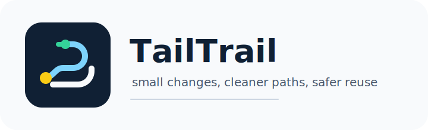

# TailTrail



TailTrail is a small local development helper for making cleaner, smaller, reuse-first code changes across Codex, Claude, Cursor, GitHub Copilot, ChatGPT, and Gemini.

TailTrail's default workflow is simple: start with one command, review the plan, then approve or edit the next step. The goal is to help an agent read the existing code before changing it, reuse project patterns, avoid unnecessary dependencies, keep diffs easy to review, and preserve important safeguards.

## Start Here

For most coding tasks:

```bash
python3 scripts/tailtrail.py do "describe your task"
python3 scripts/tailtrail.py start "describe your task"
python3 scripts/tailtrail.py "describe your task"
python3 scripts/tailtrail.py next
```

`do` and free-form task input route to `start`, so Navigator is the default habit for normal work. Use direct commands such as `review`, `graph`, `quality`, or `report` when you intentionally want that specific backend feature.

Optional install: run `pipx install .` from this checkout to add `tailtrail` to `PATH`; `python3 scripts/tailtrail.py ...` remains the leading, always-available command path.

`hello` and `start` show a compact startup banner in terminal output:

```text
╭────────────────────────────────────────────╮
│ TailTrail                                  │
│ Navigator online. Context stays lean.      │
│                                            │
│ Navigator • Code Graph • Guardrails        │
│ AIDLC • Review Lenses • Test Precision     │
│ Token Budget • CI/Sonar • Security         │
│ Learning • Handoff • Value Reports         │
│ Meta-Harness • Shared Metadata             │
╰────────────────────────────────────────────╯
```

Use `TAILTRAIL_QUIET=1` or `--quiet` when you want script-friendly output. The banner is also skipped for `start --format json`.

If you already know the likely file:

```bash
python3 scripts/tailtrail.py do "describe your task" --changed path/to/file
```

`start` is compact by default: it shows the recommended path, files to inspect first, key commands, post-change Review, Meta-Harness checks, token/evidence posture, and approval prompts. Use `--verbose` when you want the full Navigator plan:

```bash
python3 scripts/tailtrail.py start "describe your task" --changed path/to/file --verbose
```

For local guardrail checks before commit:

```bash
python3 scripts/tailtrail.py guard check
```

For full task-first usage:

- [QUICKSTART.md](QUICKSTART.md): shortest path from task to command.
- [CHEATSHEET.md](CHEATSHEET.md): one-page problem-to-command map.
- [USEFUL-PROMPTS.md](USEFUL-PROMPTS.md): end-user prompt cookbook with feature combinations and likely outputs.
- [USER-GUIDE.md](USER-GUIDE.md): full setup and feature guide.
- [TAILTRAIL-COMMANDS.md](TAILTRAIL-COMMANDS.md): complete command catalog.
- [ASSISTANT-COMPATIBILITY.md](ASSISTANT-COMPATIBILITY.md): assistant support levels, adapter limitations, and validated adapter contract.
- [EVALUATION-HARNESS.md](EVALUATION-HARNESS.md): design plan for consolidating benchmarks, efficacy, telemetry, quality loop, Meta-Harness, Token Harness proof, and future scenario evaluation.
- [buildweek-demo-project/](buildweek-demo-project/): clean competition/demo target project for showing TailTrail on a small failing validation workflow.

TailTrail helps with local, evidence-aware AI coding workflows. It does not replace source inspection, tests, CI, scanners, code review, security review, legal review, or release approval.

## What It Provides

- A Codex implementation skill at `skills/tailtrail/SKILL.md`.
- A Codex review skill at `skills/tailtrail-review/SKILL.md`.
- A plugin manifest at `.codex-plugin/plugin.json`.
- Tool adapters:
  - `CLAUDE.md`
  - `.cursor/rules/tailtrail.mdc`
  - `.github/copilot-instructions.md`
  - `.openai/chatgpt-instructions.md`
  - `GEMINI.md`
- Adapter sources in `adapters/`.
- Assistant compatibility matrix in `ASSISTANT-COMPATIBILITY.md`.
- Assistant-specific prompt packs in `adapters/prompts/`.
- Portable project guidance in `AGENTS.md`.
- A portable AI Development Lifecycle in `AIDLC.md`.
- AIDLC stage playbooks in `aidlc/stages/`.
- AIDLC security and testing baselines in `aidlc/extensions/`.
- A dependency approval guide in `DEPENDENCY-GATE.md`.
- An agent behavior contract in `GUARDRAILS.md`.
- A single synchronized governance block in `GOVERNANCE.md`.
- Task-specific guardrail layers, including code consistency, in `context/guardrail-layers.md`.
- A local policy template in `tailtrail-policy.example.md`, optional structured policy override template, and `scripts/policy-check.py`.
- A design plan in `DESIGN.md`.
- A step-by-step user guide in `USER-GUIDE.md`.
- A useful prompt cookbook in `USEFUL-PROMPTS.md`.
- A future-scope roadmap in `ROADMAP.md`.
- A token-reduction plan in `TOKEN-SLICER.md`.
- An automatic token-saving decision layer in `TOKEN-AUTOPILOT.md`.
- A Token Slicer foundation in `context/`.
- A Token Autopilot CLI at `scripts/token-auto.py`.
- A Token Budget Coach at `scripts/token-budget-coach.py`.
- Prompt compression profiles at `scripts/prompt-profile.py`.
- Context receipts at `scripts/context-receipt.py`.
- A deterministic Token Router CLI at `scripts/route-context.py`.
- A prompt intent expansion agent at `scripts/expand-intent.py`.
- A unified local command surface at `scripts/tailtrail.py`.
- An optional `tailtrail` command launcher installer at `scripts/install-launcher.py`.
- A command catalog in `TAILTRAIL-COMMANDS.md`.
- A one-command task start report at `scripts/task-start.py`.
- A deterministic Navigator at `scripts/navigator.py`.
- Cross-Repo Reference Mode at `scripts/cross-repo-reference.py` for read-only sibling repo pattern usage.
- Named flow and review-lens guidance in `context/flow-catalog.md` and `context/review-lenses.md`.
- Optional hook wrappers at `hooks/tailtrail-lifecycle-hook.py`, `hooks/token-autopilot-hook.py`, and `hooks/token-router-hook.py`.
- Lightweight project learnings at `templates/learnings.md` and `scripts/learnings.py`.
- Learning Agent V2 at `scripts/learning-agent.py` for confidence-gated event capture, search, and promotion.
- Learning governance in `LEARNING-GOVERNANCE.md` and `scripts/learning-review.py` for safe reuse, review thresholds, and noise detection.
- Graph-Aware Learning at `scripts/graph-learning.py` for linking learnings to files, symbols, rules, endpoints, tables, and manifests.
- Learning Refresh at `scripts/learning-refresh.py` for advisory stale/noisy learning review and approved suppression.
- Reusable compact evidence, risk, and handoff templates in `templates/`.
- Original examples in `examples/`.
- A governance sync/check helper at `scripts/sync-governance.py`.
- AIDLC project scripts at `scripts/aidlc-init.py` and `scripts/aidlc-check.py`.
- A GitHub Copilot installer at `scripts/install-copilot.py`.
- A local setup assistant at `scripts/install-local.py`.
- A cloned-repo setup hygiene scanner at `scripts/setup-scan.py`.
- A safe GitHub Copilot pack updater at `scripts/update-copilot.py`.
- A general TailTrail updater at `scripts/update-tailtrail.py`.
- A team setup helper at `scripts/team-init.py`.
- Adoption Outcome Telemetry at `scripts/outcome-telemetry.py`.
- Bootstrap Snapshot at `scripts/bootstrap-snapshot.py` for safe pre-task repo/runtime facts before Navigator planning.
- Meta-Harness Review at `scripts/harness-review.py` for local workflow-fit review, bootstrap fit, metric confidence, sanitized summary export, approved commit-friendly shared metadata in `tailtrail-meta/`, sanitized shared aggregation, and evidence-gated product-improvement proposals.
- Feature Registry at `scripts/tailtrail-registry.py` for read-only feature inventory, install surface metadata, command ownership, and strict drift validation.
- An offline benchmark harness at `scripts/benchmark-tailtrail.py`.
- A measured-efficacy benchmark at `scripts/efficacy-benchmark.py`.
- A benchmark behavior analyzer at `scripts/analyze-benchmark.py`.
- Security And Vulnerability Intelligence at `scripts/vulnerability-scan.py`, `scripts/vulnerability-run.py`, and `scripts/vulnerability-summary.py`.
- Test Precision Planner at `scripts/test-precision.py` for focused unit/regression test placement and validation planning.
- A Code Review Graph Lite impact mapper at `scripts/review-graph.py`.
- Dependency-free AST Lite / AST V1 / Semantic V2 maps at `scripts/ast-map.py`.
- Opt-in Semantic V3 provider-output ingestion at `scripts/ast-map.py`, requiring explicit `--approved` or local policy enablement and labeling evidence as `heuristic`, `local-ast`, `provider-backed`, or `measured/validated`.
- Scanner Graph Overlay at `scripts/scanner-graph-overlay.py` for connecting local Sonar and vulnerability evidence to graph impact.
- A persistent Code Graph Mapper cache at `scripts/code-graph-mapper.py` for heavy Sonar, vulnerability, QA, dependency, review, release, and handoff work, including partitions, service hints, endpoint/service/table flows, ownership, tests, and release paths.
- Evidence-based engine helpers at `scripts/summarize-output.py`, `scripts/slice-context.py`, `scripts/cache-summary.py`, and `scripts/prune-context.py`.
- Adapter sync script at `scripts/sync-adapters.py`.

## Using It In Codex

Start with `USER-GUIDE.md` if you are installing or using TailTrail for the first time.

For daily local usage, start with the unified command surface:

```bash
python3 scripts/tailtrail.py help
python3 scripts/tailtrail.py install launcher --dry-run
python3 scripts/tailtrail.py install launcher
python3 scripts/tailtrail.py hello
python3 scripts/tailtrail.py commands
python3 scripts/tailtrail.py start "fix Sonar issue and prepare PR"
python3 scripts/tailtrail.py start "fix Sonar issue" --changed src/service/foo.py
python3 scripts/tailtrail.py start "fix Sonar issue" --changed src/service/foo.py --verbose
python3 scripts/tailtrail.py guide "fix Sonar issue and prepare PR"
python3 scripts/tailtrail.py guide "fix Sonar issue" --changed src/service/foo.py
python3 scripts/tailtrail.py bootstrap snapshot --root . --write-result
python3 scripts/tailtrail.py bootstrap status --root .
python3 scripts/tailtrail.py graph --changed src/service/foo.py
python3 scripts/tailtrail.py graph ast --changed src/service/foo.py --depth v1
python3 scripts/tailtrail.py graph ast --changed src/service/foo.py --depth v2
python3 scripts/tailtrail.py graph ast --changed src/service/foo.py --depth v3 --provider-output tailtrail-meta/providers/semantic.json --approved
python3 scripts/tailtrail.py graph overlay --sonar sonar.log --changed src/service/foo.py
python3 scripts/tailtrail.py setup-scan --root .
python3 scripts/tailtrail.py reference --target /path/to/service-a --reference /path/to/service-b --goal "match validation style"
python3 scripts/tailtrail.py guard check
python3 scripts/tailtrail.py guard check --enforce
python3 scripts/tailtrail.py governance check
python3 scripts/tailtrail.py ci summarize --file ci.log
python3 scripts/tailtrail.py sonar summarize --file sonar.log
python3 scripts/tailtrail.py quality scan --changed src/service/foo.py
python3 scripts/tailtrail.py test plan --changed src/service/foo.py --goal "fix validation bug"
python3 scripts/tailtrail.py test summarize --changed src/service/foo.py --goal "show implemented test cases"
python3 scripts/tailtrail.py quality-loop review --month 2026-07
python3 scripts/tailtrail.py outcome summarize --month 2026-07
python3 scripts/tailtrail.py learn review --root .
python3 scripts/tailtrail.py learn govern --root .
python3 scripts/tailtrail.py report --month 2026-07
python3 scripts/tailtrail.py report value --month 2026-07
python3 scripts/tailtrail.py report trend
python3 scripts/tailtrail.py report pr --only quality --only tokens
python3 scripts/tailtrail.py benchmark efficacy
python3 scripts/tailtrail.py telemetry manual --task-id demo-001 --provider openai --model gpt-5 --baseline-total 45000 --tailtrail-total 20500
python3 scripts/tailtrail.py telemetry import-openai --source openai-usage.jsonl --output .tailtrail/token-usage.jsonl
python3 scripts/tailtrail.py savings report --telemetry templates/token-usage-example.jsonl
python3 scripts/tailtrail.py registry list
python3 scripts/tailtrail.py registry validate --strict
python3 scripts/tailtrail.py adapters check
python3 scripts/tailtrail.py adapters sync
python3 scripts/tailtrail.py doctor
python3 scripts/tailtrail.py vulnerability scan --changed package.json
python3 scripts/tailtrail.py vulnerability summarize --file audit.log
python3 scripts/tailtrail.py vulnerability summarize --file codeql.sarif
python3 scripts/tailtrail.py vulnerability summarize --file trivy.json --format json
python3 scripts/tailtrail.py engine summarize-output --file build.log
python3 scripts/tailtrail.py engine slice-context --file src/service/foo.py --query validate
python3 scripts/tailtrail.py engine cache-summary
python3 scripts/tailtrail.py engine prune-context --file noisy-context.md
```

The launcher installer creates `tailtrail` and a narrow `hello` alias so both forms work from any repo:

```bash
tailtrail hello
hello tailtrail
```

The `hello` alias handles `hello tailtrail`, `hello TailTrail`, and the common typo `hello taitrail`, then delegates to `tailtrail hello`. If you installed the launcher before the alias existed, rerun `python3 scripts/tailtrail.py install launcher --force`.

The wrapper delegates to the existing scripts. Use `hello` as the fast installation smoke check; it confirms TailTrail is reachable and prints the source or installed-pack location. Use `doctor` for full package validation. Use `setup-scan` first when a cloned repo already contains TailTrail files; it classifies shared project context, overrides, installed packs, local runtime state, and `.gitignore` recommendations without writing anything. Use `reference` when one repo is the editable target and another repo is a read-only sibling/reference source; it confirms boundaries and recommends compact reference summaries instead of broad sibling repo reads. Use `guard check` when you want local advisory or enforce-mode guardrail checks before commit. Use `governance check` when editing repeated behavior text; `GOVERNANCE.md` owns the synchronized marked block while `GUARDRAILS.md` remains the full behavior contract. Use `do`, `start`, or free-form task input as the preferred first command for non-trivial work: all three run Navigator and add a compact report for approximate token posture, learning quality, and install/update checks. Navigator returns an approval-first plan with selected features, skipped features, impacted files, suggested commands, and validation guidance. For read-only prompts such as "tell me important features of this repo", Navigator selects a compact Repo Overview / Discovery plan instead of the full workflow matrix and shows Code Graph Mapper as an optional deeper discovery command; the graph cache is not created unless the user approves and runs `graph map`. For meaningful code-change prompts, Navigator checks Code Graph Mapper status and recommends map, refresh, or reuse before broad source reads; tiny typo and docs-only work skip this. It does not start a background service, install a global command, implement changes automatically, or record learnings automatically. When a goal mentions target/reference repos or sibling repo patterns, Navigator selects Cross-Repo Reference Mode and reminds the user that only the target repo should be edited. When a goal asks for Sonar checks, quality-gate prechecks, vulnerability scans, dependency audits, or broad scanner work, Navigator adds a Scan Approval section and defaults to `no` until the user approves a specific command. When a goal mentions unit tests, regression tests, coverage, test cases, or post-change validation, Navigator selects Test Precision Planner and suggests the exact read-only `test plan` command. Code intelligence defaults to local-only AST Lite, AST V1, and Semantic V2. Semantic V3 is never automatic: it only ingests approved local provider JSON when the command includes `--approved` or `tailtrail-policy.md` enables provider-backed ingestion, and graph reports label evidence as `heuristic`, `local-ast`, `provider-backed`, or `measured/validated`. When graph-aware learnings match, Navigator asks whether to `use learnings`, `ignore learnings`, or `edit plan`; learnings are advisory only and never override current source, CI, scanners, policy, guardrails, or explicit user direction. For meaningful completed work, Navigator includes a post-task Learning Capture Trigger, but learning files are written only after explicit approval. CI/Sonar summary commands compact provided local logs without polling CI, querying SonarQube/SonarCloud, or running scanners. Quality Signal Scanner recommends local checks from manifests and only runs one exact allowlisted command with `--approved`. Test Precision Planner recommends likely test files, reusable helpers, focused regression cases, and focused validation commands without writing or running tests. Quality Loop records approved compact TailTrail behavior events, summarizes workflow fit, and proposes reviewable improvements without changing TailTrail rules automatically. Adoption Outcome Telemetry records only approved compact outcome events such as acceptance, validation, review result, escaped defect signal, time-saved band, fit, and learning quality. Token savings are estimated unless the user supplies real model/API usage telemetry; measured reports then show before TailTrail, with TailTrail, difference, and percentage reduction for those records only. Enterprise Reporting generates local advisory reports from quality, outcomes, learning, refresh, optional AIDLC, and token evidence without uploading data or including raw prompts by default. Security And Vulnerability Intelligence recommends vulnerability commands without running them, runs only one exact approved scanner command, and summarizes scanner output into a structured vulnerability list.

The `start` output begins with **Start Here** and a **Decision Menu**. A user can review the plan, approve implementation, edit the plan, confirm focused validation, approve exactly one scan command, choose how to handle surfaced learnings, or ask for a leaner workflow before any source files are changed.

Use the skills when asking for implementation, bug fixes, refactors, dependency choices, or reviews:

```text
@tailtrail implement this with the smallest clear change
@tailtrail lean add this endpoint
@tailtrail strict challenge this design before coding
@tailtrail-review review this diff for unnecessary code
@tailtrail simplify this without removing safeguards
```

TailTrail should guide Codex to:

- Inspect the relevant code path first.
- Reuse existing helpers and conventions.
- Prefer standard library and platform-native features.
- Avoid new dependencies unless clearly justified.
- Preserve validation, security, accessibility, data integrity, and explicit requirements.
- Use `GUARDRAILS.md` for non-trivial, risky, review-heavy, dependency-sensitive, lifecycle-driven, or unclear work.
- Use `context/guardrail-layers.md` for task-specific checks such as implementation, code consistency, review, QA, dependency, AIDLC, handoff, CI/Sonar, release, and token saving.
- Use `tailtrail-policy.md` when present in a target project for local commands, validation expectations, dependency approvals, ownership, restricted folders, and security requirements.

Use AIDLC for broad, risky, ambiguous, multi-team, regulated, or long-running work:

```text
@tailtrail use AIDLC standard depth to plan this feature
@tailtrail resume from aidlc-docs/aidlc-state.md
@tailtrail use the dependency gate before adding a package
```

For short daily prompts, use the intent expansion agent:

```bash
python3 scripts/expand-intent.py "use AIDLC"
python3 scripts/expand-intent.py "use AIDLC and review"
python3 scripts/expand-intent.py "use delivery flow"
python3 scripts/expand-intent.py "use architecture review"
python3 scripts/expand-intent.py "use CI Sonar"
python3 scripts/expand-intent.py "use dependency gate" --format json
```

The agent expands compact phrases into the full TailTrail workflow. Projects can customize expansions with `.tailtrail/intent-overrides.json` or `tailtrail/intent-overrides.json`, using `templates/intent-overrides.json` as the starting shape.

## Modes

TailTrail supports three lightweight modes inside the main skill:

| Mode | Purpose |
|---|---|
| `steady` | Default mode for normal implementation work. |
| `lean` | Smallest clear implementation, with skipped work called out. |
| `strict` | Challenge scope before building and prefer the smallest useful version. |

Modes are requested in the prompt. There is no global mode state in V1.6.

## Local Plugin Use

This repo is already laid out as a Codex plugin source. For local development, keep the repo as-is and point Codex at this plugin using your normal local plugin workflow.

To install portable TailTrail project guidance for Codex without overwriting an existing `AGENTS.md`, run:

```bash
python3 scripts/tailtrail.py install codex --target /path/to/project --dry-run
python3 scripts/tailtrail.py install codex --target /path/to/project
```

To install the Codex plugin source and skills into a target project, run:

```bash
python3 scripts/tailtrail.py install codex-plugin --target /path/to/project --dry-run
python3 scripts/tailtrail.py install codex-plugin --target /path/to/project
```

The Codex guidance installer writes `AGENTS.md` only. It does not write global Codex configuration, install a plugin, change IDE settings, or enable hooks. The plugin installer writes `.codex-plugin/plugin.json`, the `skills/` source needed for native `@tailtrail` and `@tailtrail-review` invocation, and a complete managed TailTrail pack under `tailtrail/` with scripts, context, guardrails, policy templates, AIDLC, hooks, benchmarks, and reporting tools. It does not write Copilot instructions. If you only want portable project guidance, you can also copy `AGENTS.md` into the root of the target project.

## Using `AGENTS.md`

Keep `AGENTS.md` at the root of a local project when you want portable guidance for coding agents that read project instructions. It gives the same compact workflow without requiring hooks or additional adapters.

## Using Local Policy

Copy `tailtrail-policy.example.md` to `tailtrail-policy.md` in a target project when the team needs local commands, validation expectations, dependency approvals, ownership, restricted folders, security requirements, CI/Sonar expectations, or release notes.

`tailtrail-policy.md` is plain-text guidance. It should extend TailTrail rules without silently weakening `GUARDRAILS.md`, `DEPENDENCY-GATE.md`, or explicit user requirements.

You can initialize and validate local policy files with:

```bash
python3 scripts/tailtrail.py policy init --root /path/to/project --with-overrides
python3 scripts/tailtrail.py policy check --root /path/to/project --with-overrides --strict
```

The optional structured file lives at `.tailtrail/policy-overrides.json`. It is local metadata, not a hidden policy engine.

## Using Other Assistants

TailTrail is Codex-first. Other assistants are supported through portable instruction adapters, and behavior depends on how each assistant loads and follows project instructions. See `ASSISTANT-COMPATIBILITY.md` for support levels and limitations.

TailTrail includes tool-facing adapter files:

| Assistant | File |
|---|---|
| Codex | `AGENTS.md`, `.codex-plugin/plugin.json`, `skills/tailtrail/SKILL.md`, `skills/tailtrail-review/SKILL.md` |
| Claude | `CLAUDE.md` |
| Cursor | `.cursor/rules/tailtrail.mdc` |
| GitHub Copilot | `.github/copilot-instructions.md` |
| ChatGPT | `.openai/chatgpt-instructions.md` |
| Gemini | `GEMINI.md` |

The source files live in `adapters/`. Assistant-specific prompt packs live in `adapters/prompts/`. Keep adapters synced and validate the required behavior contract with:

```bash
python3 scripts/tailtrail.py adapters check
python3 scripts/tailtrail.py adapters sync
python3 scripts/sync-adapters.py --check
python3 scripts/sync-adapters.py --write
```

ChatGPT support is provided as a portable project instruction file that can be uploaded, referenced, or copied into a ChatGPT project. Codex support remains native through the plugin skills.

For GitHub Copilot setup, prefer:

```bash
python3 scripts/install-copilot.py --root /path/to/project --with-tailtrail-pack
```

This writes `.github/copilot-instructions.md` and keeps the TailTrail support pack under `/path/to/project/tailtrail/`. Use `--pack-dir tools/tailtrail` for a custom managed folder.

The installed pack includes `tailtrail/context/guardrail-layers.md` so Copilot and other instruction-file assistants can load only the relevant implementation, code consistency, review, QA, dependency, AIDLC, handoff, CI/Sonar, release, or token-saving layer.

To update an existing installed pack, use:

```bash
python3 scripts/update-copilot.py --root /path/to/project --dry-run
python3 scripts/update-copilot.py --root /path/to/project
python3 scripts/update-tailtrail.py --root /path/to/project --dry-run
```

The updater preserves locally modified TailTrail-managed files by default. If you want to refresh them while keeping backups, use `--strategy backup-overwrite`. Keep team prompt customizations in `.tailtrail/intent-overrides.json` or `tailtrail/intent-overrides.json` so core TailTrail files can be updated cleanly.

See `USER-GUIDE.md` for the full Copilot setup flow.

For a guided local setup entry point, use:

```bash
python3 scripts/install-local.py --inspect
python3 scripts/install-local.py --target /path/to/project --profile full --dry-run
python3 scripts/install-local.py --target /path/to/project --profile full
```

The local installer avoids network calls and global machine writes. It supports only a small set of profiles: `inspect`, `generic`, `copilot`, `aidlc`, `hooks`, and `full`.

By default, TailTrail setup/runtime files are local-only in target projects. The installer adds `.gitignore` entries for `.tailtrail/`, the managed `tailtrail/` pack, and assistant setup files so they do not get pushed accidentally. The default TailTrail folder intended for reviewed team sharing is `tailtrail-meta/`.

If TailTrail setup files were already staged in a target repo, unstage them and keep only reviewed metadata:

```bash
git restore --staged tailtrail .tailtrail .github/copilot-instructions.md AGENTS.md AIDLC.md
python3 scripts/tailtrail.py setup-scan --root .
python3 scripts/tailtrail.py guard check --enforce
```

Initialize team guidance and project learnings with:

```bash
python3 scripts/team-init.py --root /path/to/project --mode optional
python3 scripts/learnings.py init --root /path/to/project
```

Run local benchmark scenarios with:

```bash
python3 scripts/benchmark-tailtrail.py
python3 scripts/benchmark-tailtrail.py --scenario native-date-field
python3 scripts/benchmark-tailtrail.py --format json
python3 scripts/benchmark-tailtrail.py --format json > benchmarks/results/latest.json
python3 scripts/analyze-benchmark.py benchmarks/results/latest.json
python3 scripts/tailtrail.py benchmark efficacy
python3 scripts/tailtrail.py benchmark efficacy --format json
```

The benchmark harness scores saved artifacts only. The efficacy benchmark compares committed baseline and TailTrail-guided artifacts for governance signals such as dependency discipline, validation truth, safeguard preservation, diff size, and review finding quality. The behavior analyzer interprets benchmark scores and recommends improvement areas. These scripts do not call models, use the network, edit TailTrail files automatically, or claim universal vendor/model improvements.

## Code Review Graph Lite

Generate a compact review impact map before broad source reading:

```bash
python3 scripts/review-graph.py --changed src/service/foo.py
python3 scripts/review-graph.py --changed src/service/foo.py --format json
python3 scripts/tailtrail.py graph map --changed src/service/foo.py
python3 scripts/tailtrail.py graph status --changed src/service/foo.py
```

The graph uses simple explainable signals: imports, file naming conventions, test proximity, local text search, manifest/config proximity, module/service partitions, CODEOWNERS, release path hints, and endpoint/service/table metadata. It does not use a graph database, vector database, model call, or background service.

For deeper local structure without external dependencies, use AST maps:

```bash
python3 scripts/tailtrail.py graph ast --changed src/service/foo.py --depth lite
python3 scripts/tailtrail.py graph ast --changed src/service/foo.py --depth v1
python3 scripts/tailtrail.py graph ast --changed src/service/foo.py --depth v2
```

AST Lite reports structured symbols for selected files. AST V1 adds symbol references, call hints, type hierarchy hints, endpoint hints, DB/config hints, likely tests, and changed-symbol impact. Semantic V2 adds a local symbol index, import/module edges, reference edges, endpoint-to-handler links, data-flow-lite hints, and provider readiness for language servers, SCIP, Roslyn, and tree-sitter. It is still metadata-only and does not start providers, install parser packages, use vector databases, call models, or run a background service.

For scanner remediation, use the overlay after saving local scanner output:

```bash
python3 scripts/tailtrail.py graph overlay --sonar sonar.log --changed src/service/foo.py
python3 scripts/tailtrail.py graph overlay --vulnerability audit.log --changed package.json
```

The overlay preserves scanner evidence and connects it to impacted files, scopes, likely tests, related files, AST V1 hints, and next graph commands. It does not run scanners or prove findings are fixed.

## Using AIDLC

Copy `AIDLC.md`, `DEPENDENCY-GATE.md`, `AGENTS.md`, and the needed `templates/` files into a target project when you want a portable lifecycle.

Store generated lifecycle artifacts in `aidlc-docs/` inside the target project. Start with `templates/aidlc-state.md` and `templates/aidlc-audit.md`, then add question, gate, change brief, and diff handoff templates only when they reduce ambiguity or risk.

Initialize and check a target project with:

```bash
python3 scripts/aidlc-init.py --root /path/to/project --depth standard
python3 scripts/aidlc-check.py --root /path/to/project
```

For comprehensive work, `aidlc-check.py` validates structure by default. Add `--strict-answers` after `questions.md` is expected to be answered.

AIDLC has three depths:

| Depth | Use When |
|---|---|
| `minimal` | Clear, low-risk, small-scope work. |
| `standard` | Normal feature, bug, or refactor work. |
| `comprehensive` | High-risk, multi-team, regulated, production-sensitive, or system-wide work. |

Handoff is the transfer package for review, validation, operations, or another agent. Use `aidlc/stages/handoff.md` with `templates/diff-handoff.md`, `templates/validation-handoff.md`, or `templates/operations-notes.md`.

## Using Token Autopilot And Token Slicer

Token Autopilot decides whether token routing is worth using.

```bash
python3 scripts/token-auto.py "rename this variable"
python3 scripts/token-auto.py "review this diff for dependency risk"
```

For tiny low-risk work, it returns `skip` and avoids loading TailTrail docs. For non-trivial work, it routes to one slice.

For broad, repeated, or noisy work, `context/TailTrail.map.md` points to one relevant slice in `context/slices.md` so the agent does not load every TailTrail document.

Use `context/token-router.md` when the task is specifically about choosing a token-saving technique. Use the templates in `templates/` when you need a compact handoff for project context, router decisions, impact notes, or tool output.

The local CLI returns an automatic route decision:

```bash
python3 scripts/route-context.py review
python3 scripts/route-context.py qa
python3 scripts/route-context.py ci-sonar
python3 scripts/route-context.py release
python3 scripts/route-context.py auto review this diff for extra dependencies
python3 scripts/route-context.py output --format json
```

By default, Token Autopilot writes the last automatic decision to `.tailtrail/token-autopilot-state.json`, and Token Router writes the last route to `.tailtrail/token-router-state.json`. Use `--no-state` for dry validation or one-off checks.

Hosts that support prompt hooks can call:

```bash
python3 hooks/tailtrail-lifecycle-hook.py "use AIDLC and review"
python3 hooks/tailtrail-lifecycle-hook.py --startup
python3 hooks/token-autopilot-hook.py review this diff
python3 hooks/token-router-hook.py auto review this diff
```

The lifecycle hook reduces repeated prompt typing by expanding short TailTrail commands and adding the token autopilot decision. The token hooks inject only the chosen route, files to load, files to avoid, exactness risk, and fallback. They do not inject full docs.

## Examples

The `examples/` folder contains small original examples that show TailTrail's intended judgment:

- `native-date-field.md`: prefer platform-native form controls first.
- `stdlib-csv.md`: use standard library parsing before custom parsing.
- `shared-bug-fix.md`: fix the common path instead of one visible caller.
- `preserve-guard.md`: keep validation and safety guards while simplifying.

## Checking The Package

Run the local self-check after edits:

```bash
python3 scripts/check-tailtrail.py
python3 scripts/benchmark-tailtrail.py
python3 -m unittest discover -s tests
```

The check validates the expected package shape, plugin JSON, skill frontmatter, common unfinished placeholders, and deterministic tests cover Navigator core routing plus key guardrail, intent, and policy behavior.

## V1.6 Scope

V1.6 is deliberately compact. It includes a portable AIDLC V2 pack, stage playbooks, handoff guidance, guardrails, task-specific guardrail layers, local policy packs, adapter files for Claude/Cursor/Copilot/ChatGPT/Gemini, setup/update scripts, Token Autopilot, Token Router, offline benchmark tooling, Code Review Graph Lite, optional lifecycle/token hooks, optional original SVG presentation assets, and local token state files. It includes dependency-free AST Lite, AST V1, Semantic V2 metadata maps, and opt-in Semantic V3 provider-output ingestion, but does not include persisted skill mode state, direct provider execution, a semantic vector database, or a background indexing service. Those can be added later only if daily usage proves they are worth owning.

See `ROADMAP.md` for the planned path to grow the tool without making the core package confusing.

See `TOKEN-SLICER.md` for the context-reduction design. For routine usage, prefer the shorter `context/TailTrail.map.md` and `context/slices.md`.
